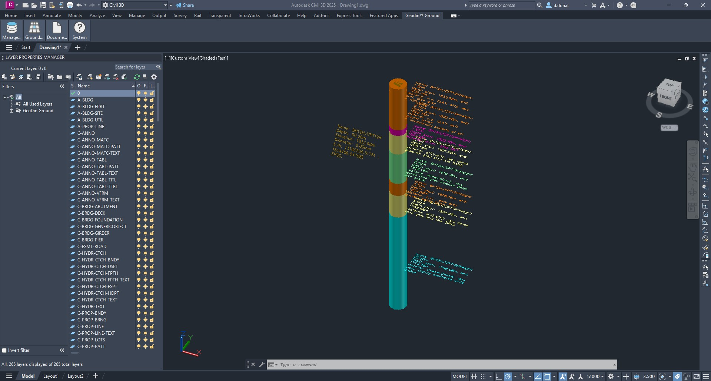
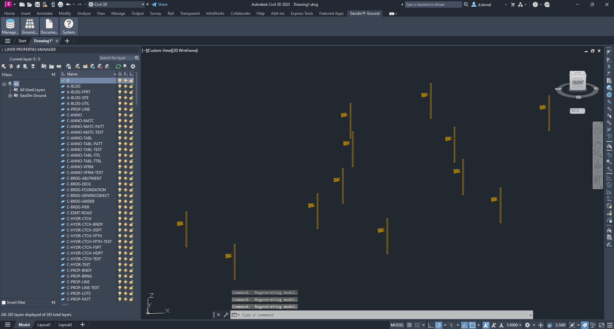
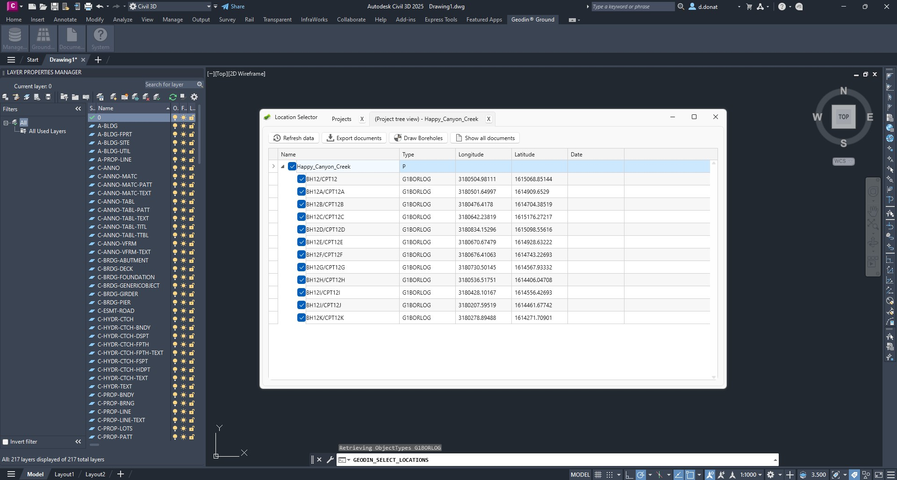
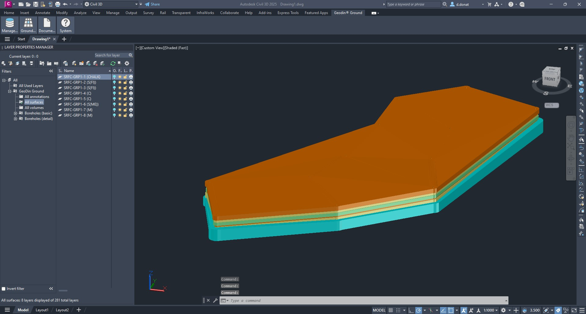
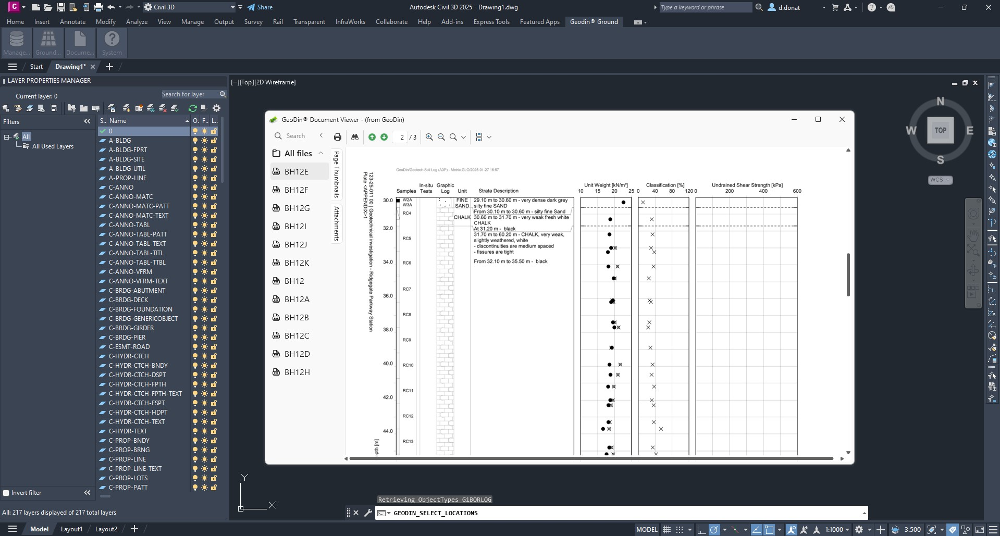

# GeoDin® Ground

GeoDin® Ground is a plugin developed by GeoDin®  and Autodesk for civil and design engineers to see below the ground in Civil 3D. With the integration and visualization of ground data in Civil 3D, the information gap between ground and design is closed. [Download the plugin here from the Autodesk App Store](https://apps.autodesk.com/CIV3D/en/Detail/Index?id=7392344363451764169&appLang=en&os=Win64&mode=preview)

<figure><figcaption></figcaption></figure>

# Description

GeoDin® Ground is a comprehensive solution offered to tackle the challenges faced by design teams and geotechnical engineers.Traditional methods of incorporating ground data into designs relied a lot on using separate sources of data and file types. GeoDin® offers you the possibility of having a single source of truth for your geodata. With GeoDin® Ground, you are able to directly access this data in Civil 3D. This allows you to create designs that are safe, efficient, effective and maximize sustainability, as the risk for overengineering is limited.

Types of ground data visualized with GeoDin Ground:    

- Borehole information   
- Standard-compliant lithological layer descriptions    
- Sample data  
- Data obtained from methods such as CPT investigations
- 50+ classification and advanced geotechnical tests 

## Screenshots and videos

<figure><figcaption></figcaption></figure>
<figure><figcaption></figcaption></figure>
<figure><figcaption></figcaption></figure>
<figure><figcaption></figcaption></figure>
<figure><figcaption></figcaption></figure>
<figure><figcaption></figcaption></figure>
