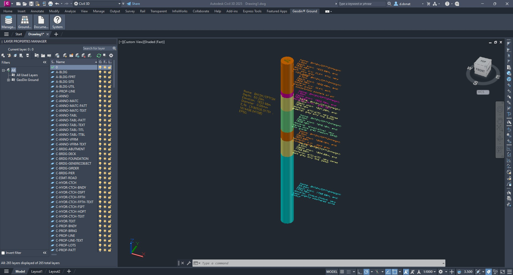
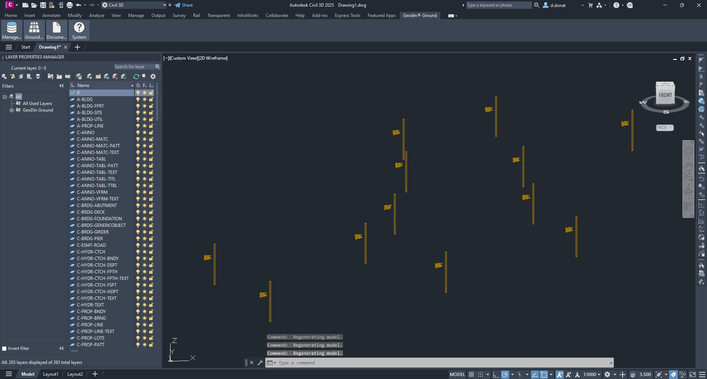
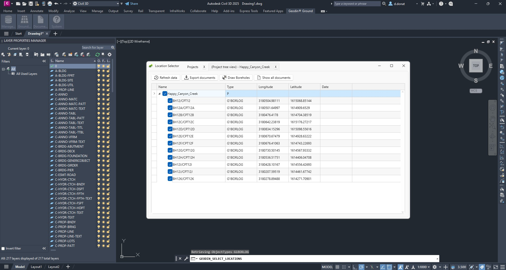
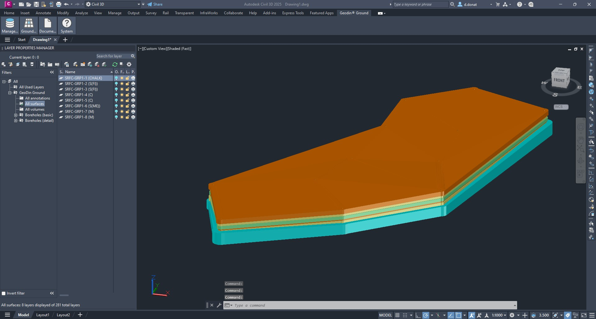
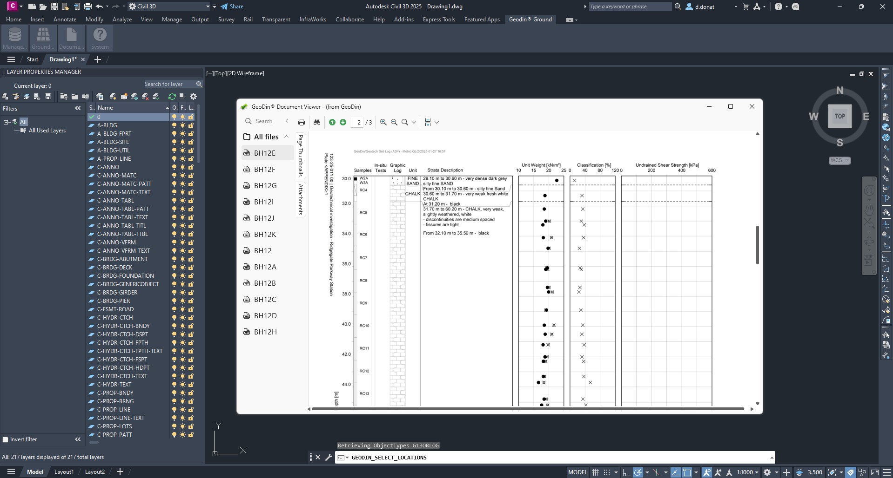

# GeoDin® Ground

GeoDin® Ground is a plugin developed by GeoDin®  and Autodesk for civil and design engineers to see below the ground in Civil 3D. With the integration and visualization of ground data in Civil 3D, the information gap between ground and design is closed. [Download the plugin here from the Autodesk App Store](https://apps.autodesk.com/CIV3D/en/Detail/Index?id=7392344363451764169&appLang=en&os=Win64&mode=preview)
<!-- CORRECTION-PROPOSED: Replace the "Download the plugin here from the Autodesk App Store" link target with the canonical Autodesk Marketplace URL https://marketplace.autodesk.com/apps/e980e6d6-57f3-4de3-b311-0da8181b0ff6 and update link text to "Autodesk Marketplace". Old URL still resolves to the same app but is not the current canonical link. -->
<!-- src: spec/autodesk-marketplace-geodin-ground-listing -->

<figure><figcaption></figcaption></figure>

# Description

GeoDin® Ground is a comprehensive solution offered to tackle the challenges faced by design teams and geotechnical engineers.Traditional methods of incorporating ground data into designs relied a lot on using separate sources of data and file types. GeoDin® offers you the possibility of having a single source of truth for your geodata. With GeoDin® Ground, you are able to directly access this data in Civil 3D. This allows you to create designs that are safe, efficient, effective and maximize sustainability, as the risk for overengineering is limited.

Types of ground data visualized with GeoDin Ground:    

- Borehole information   
- Standard-compliant lithological layer descriptions    
- Sample data  
- Data obtained from methods such as CPT investigations
- 50+ classification and advanced geotechnical tests 

## Where GeoDin® Ground fits

GeoDin® Ground is one piece of the GeoDin® ecosystem:

| Product | Role |
|---|---|
| **GeoDin®** | Desktop application and database - the source of truth for geotechnical data. |
| **GeoDin® Ground** | Civil 3D plug-in - pulls borehole data from a GeoDin® database into the design environment (this site). |
| **GeoDin® Onsite** | Windows-tablet field-capture tool - drillers fill in forms in the field; data uploads into a GeoDin® database. |

For a detailed view of which workflows live in GeoDin® versus GeoDin® Ground, see [GeoDin® and GeoDin® Ground: where each fits](documentation/geodin-vs-ground-boundary.md).

## Screenshots and videos

<figure><figcaption></figcaption></figure>
<figure><figcaption></figcaption></figure>
<figure><figcaption></figcaption></figure>
<figure><figcaption></figcaption></figure>
<figure><figcaption></figcaption></figure>
<figure><figcaption></figcaption></figure>
