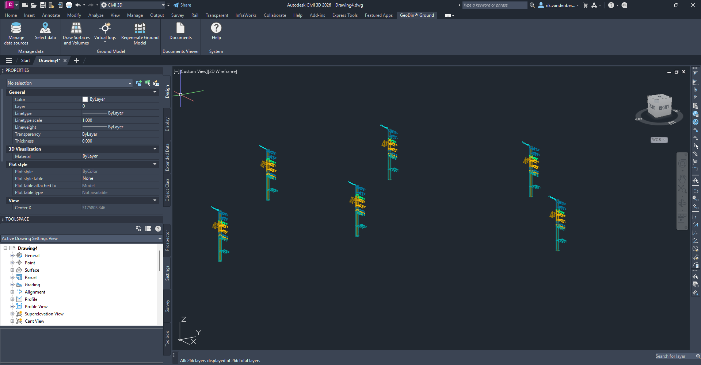
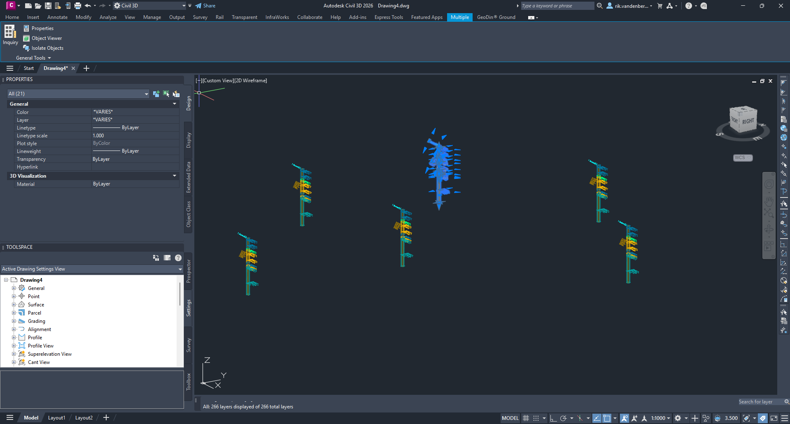
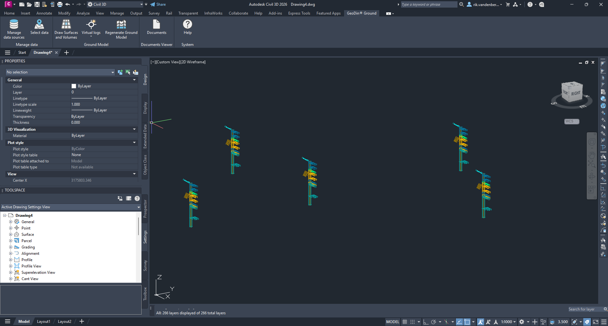
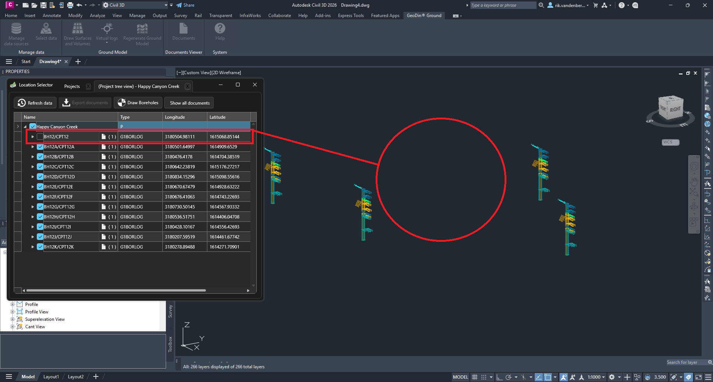

# Removing Boreholes from Your Civil 3D Drawing

This tutorial guides you through the process of deleting boreholes that have been previously imported and drawn in Civil 3D. This procedure only removes the borehole from your Civil 3D drawing and **does not delete any data from the GeoDin database**.

## Clearing your selection

Before deleting any boreholes, ensure you don't have any other objects selected in your drawing to prevent accidental deletion of other elements.

1. Click in an empty area of your drawing
2. Press ESC key to clear any active selection

## Selecting and deleting boreholes

The deletion process uses Civil 3D's standard deletion functionality, with an additional step to update our internal model ensuring surfaces and volumes can be correctly maintained.

1. Select one or multiple boreholes you wish to remove
2. Press the DELETE key on your keyboard

## Viewing the updated drawing

After deletion, you'll notice the boreholes are removed from your Civil 3D drawing. However, please note that surfaces and volumes are not automatically updated at this stage.

## Restoring accidentally deleted boreholes

If you've deleted a borehole by mistake, you can easily recover it:

1. Click the **Select Data** button in the ribbon
2. Follow the standard import procedure to bring the borehole back into your drawing

## Regenerating surfaces and volumes

To update your surfaces and volumes after deleting boreholes Use the **Regenerate Ground Model** function to rebuild your surfaces. For more detailed instructions, please see the tutorial [updating surfaces and volumes](../virtual-logs/updating-surfaces.md)

## Tip — clearing all volumes in one command

If you need to remove every volume generated by GeoDin® Ground in the current drawing — for example, before a clean regeneration with a different borehole subset — use the `DELETE_ALL_VOLUMES` command. Type it on the Civil 3D command line to clear all generated volumes at once, without having to select them manually. See the full [Civil 3D commands reference](../support/civil-3d-commands.md).