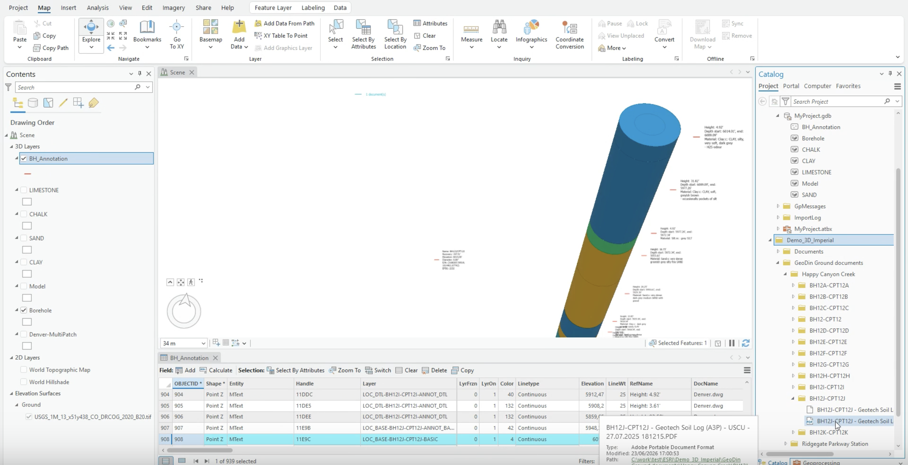
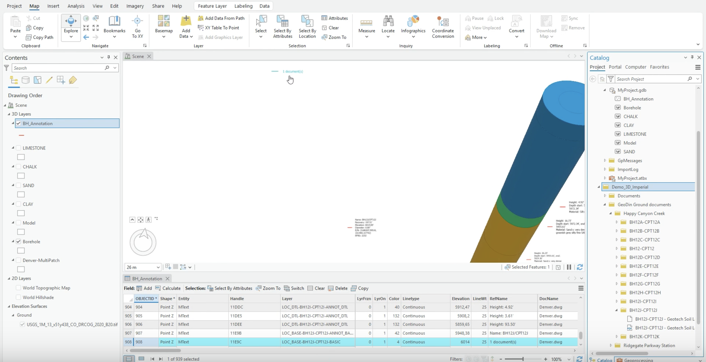
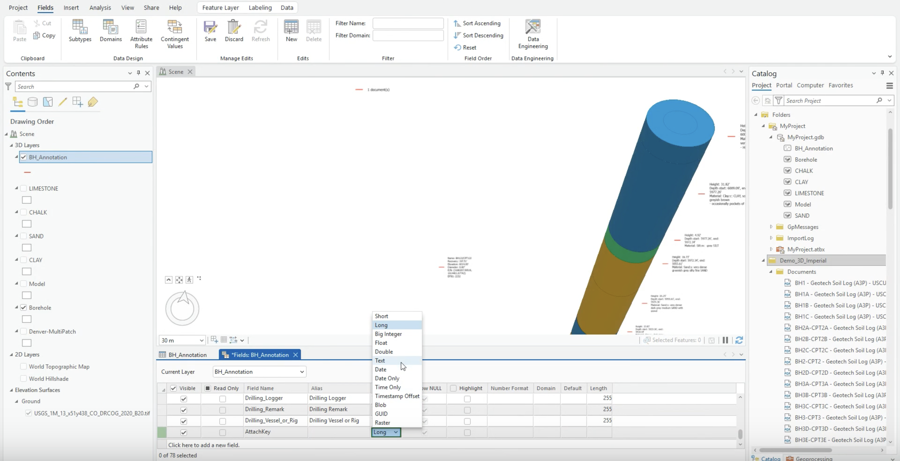
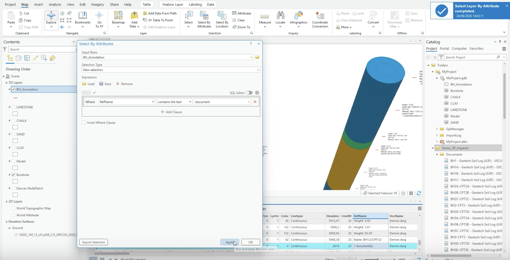
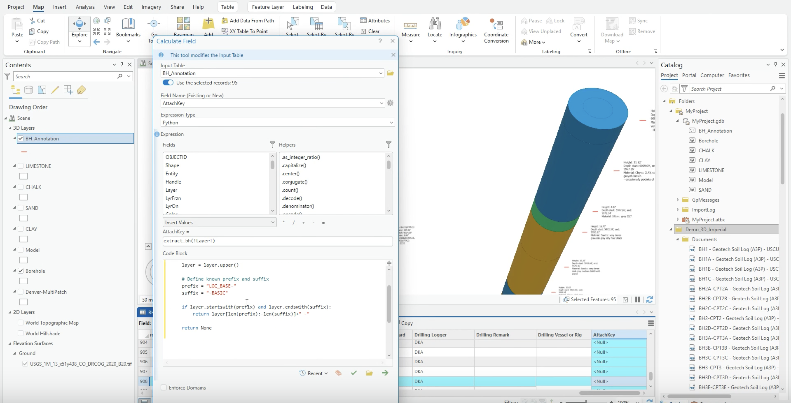
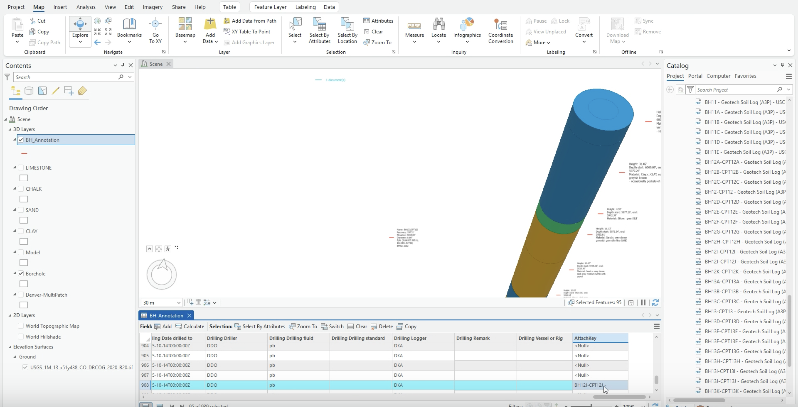
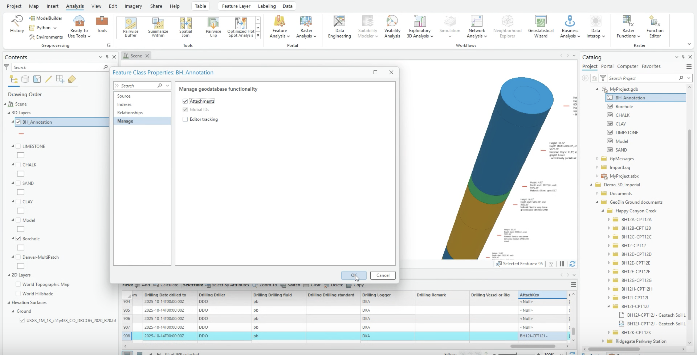
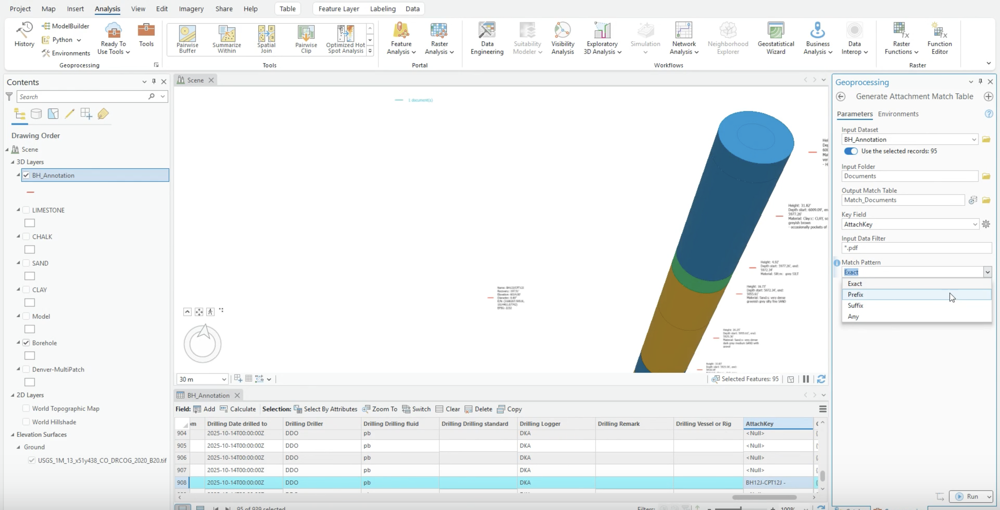
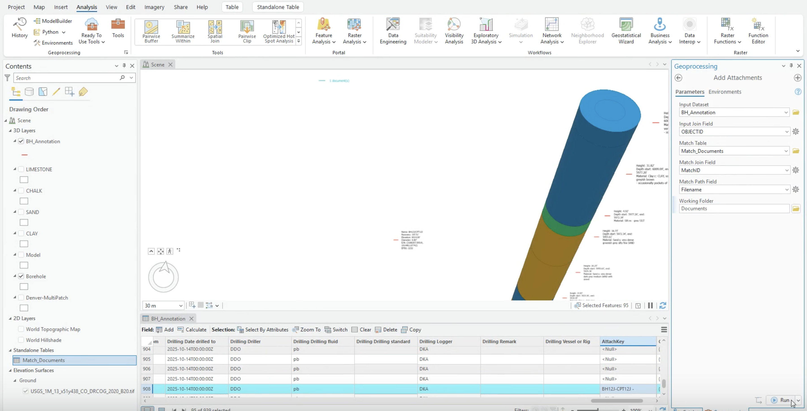
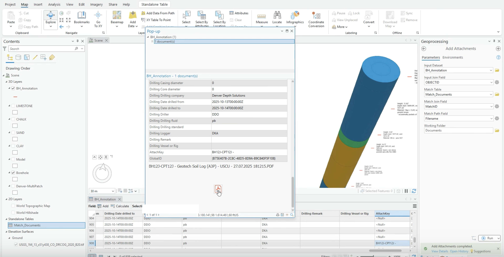

# Attaching geotechnical reports to borehole annotations

<!-- src: loom/arcgis-3d-D -->



> **Video chapters:** 0:00 How GeoDin organizes borehole report folders · 0:37 Finding document annotations · 1:14 Preparing the AttachKey field · 1:53 Selecting boreholes with linked documents · 2:25 Calculating the AttachKey values · 3:33 Enabling & generating attachment matches · 4:35 Adding the attachments · 5:34 Verifying the attached reports


When a Civil 3D drawing with GeoDin® Ground boreholes is brought into ArcGIS Pro ([previous tutorial](arcgis-pro-ground-model.md)), the exported PDF reports can be attached to each borehole's document annotation — so the right geotechnical report opens from the right feature. This tutorial builds a matching key and runs the two geoprocessing tools that wire the PDFs to the annotations.

> For the same workflow starting from GeoDin®-exported point layers (one record per borehole), see [Attach reports](https://docs.geodin.com/integrations-and-plug-ins/overview/attach-reports) in the GeoDin® documentation. The version below handles the Civil 3D annotation layer, where each borehole has **multiple** annotation records.

## Step 1: Locate the reports and confirm the annotations

- On import, GeoDin® Ground creates a documents folder next to the drawing, structured by project with one subfolder per borehole, each holding that borehole's geotechnical report.
- Copy the report PDFs into one working folder to simplify matching.

<figure><figcaption><p>The exported documents folder and a borehole's Geotech Soil Log PDF</p></figcaption></figure>

- In the annotation layer's attribute table, confirm the borehole's document record: its **RefName** reads "1 document(s)".

<figure><figcaption><p>The document annotation record in the attribute table</p></figcaption></figure>

## Step 2: Add a key field

- Open the feature class fields view and add a new field named **AttachKey** with **Data Type = Text**. Save the changes.

<figure><figcaption><p>The AttachKey field added as Text</p></figcaption></figure>

## Step 3: Select only the document annotations

- Use **Select By Attributes** with the clause: **RefName contains the text** `document`.
- Apply and verify the selection count before continuing — the key must only be calculated for these records.

<figure><figcaption><p>Selecting the document annotation records</p></figcaption></figure>

## Step 4: Calculate the key

- With the selection active, right-click **AttachKey → Calculate Field**, set **Expression Type = Python**, expression `extract_bh(!Layer!)`, and this code block:

```python
def extract_bh(layer):
    layer = layer.upper()

    # Define known prefix and suffix
    prefix = "LOC_BASE-"
    suffix = "-BASIC"

    if layer.startswith(prefix) and layer.endswith(suffix):
        return layer[len(prefix):-len(suffix)] + " -"

    return None
```

<figure><figcaption><p>Calculate Field applied to the selected records only</p></figcaption></figure>

- The trailing `" -"` is intentional: it makes the key specific enough to prefix-match exactly one report filename, so similarly named boreholes (BH1 vs. BH1A) cannot cross-match.

<figure><figcaption><p>The populated key — borehole name plus trailing dash</p></figcaption></figure>

## Step 5: Enable attachments

- Open the feature class **Properties → Manage** and enable **Attachments**. Save.

<figure><figcaption><p>Attachments enabled on the feature class</p></figcaption></figure>

## Step 6: Generate the match table

- Run the **Generate Attachment Match Table** geoprocessing tool:
  - **Input Dataset**: the annotation layer (selected records).
  - **Input Folder**: the working folder with the PDFs.
  - **Key Field**: `AttachKey` — **Input Data Filter**: `*.pdf` — **Match Pattern**: **Prefix**.

<figure><figcaption><p>Generate Attachment Match Table with Match Pattern set to Prefix</p></figcaption></figure>

## Step 7: Add the attachments

- Run **Add Attachments** with the same input dataset, **Input Join Field** `OBJECTID`, the match table from step 6, and **Match Join Field** `MatchID`.

<figure><figcaption><p>Add Attachments joining OBJECTID to MatchID</p></figcaption></figure>

## Step 8: Verify

- Click a document annotation in the scene and scroll its pop-up: the geotechnical report appears as an attachment.
- Spot-check one or two more boreholes to confirm the matching worked consistently.

<figure><figcaption><p>The report attached to the annotation, verified in the pop-up</p></figcaption></figure>

***

**Cautionary notes**

- Calculate the key **only for the selected document records** — calculating across all rows creates incorrect matches.
- If several reports have similar names, make the key format more specific before matching.
- Confirm attachments are enabled before running the match and add tools.

**Next step:** [Publish and review the model as a web scene](arcgis-web-scene.md) — the attached reports stay available in the published scene's pop-ups.
