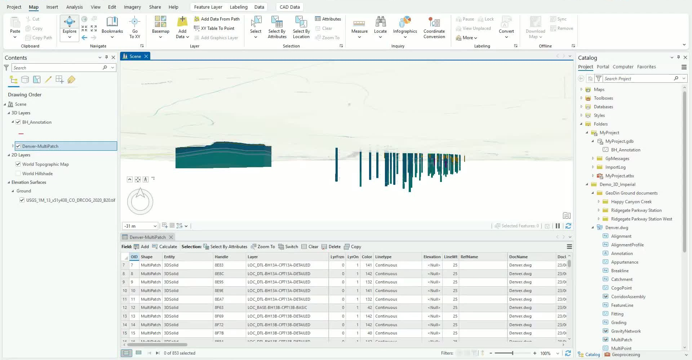
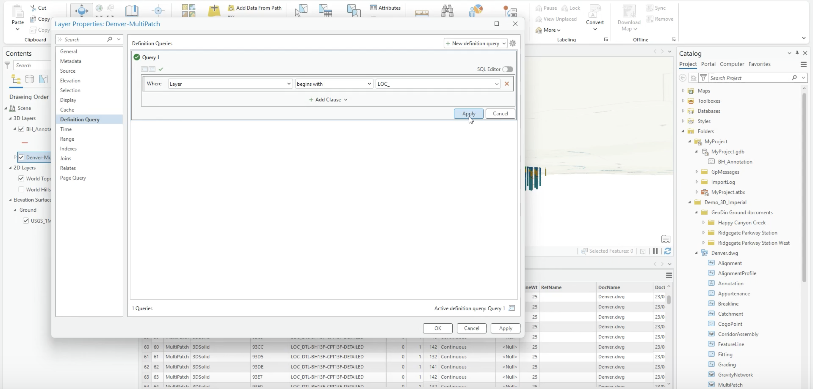
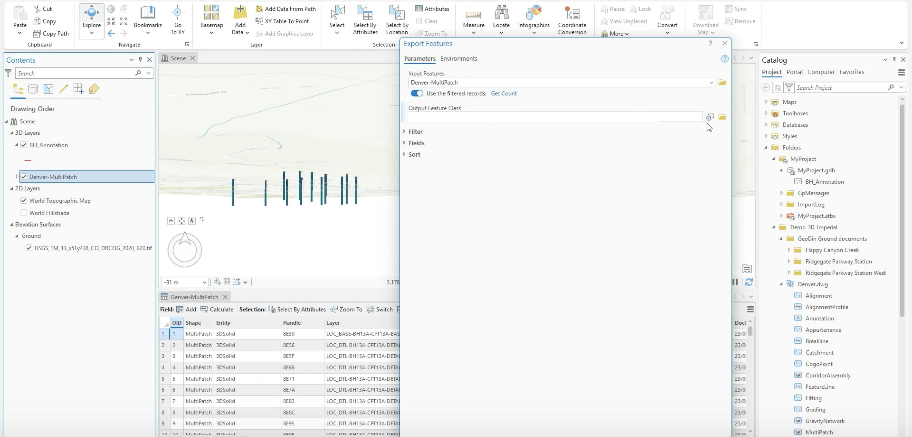
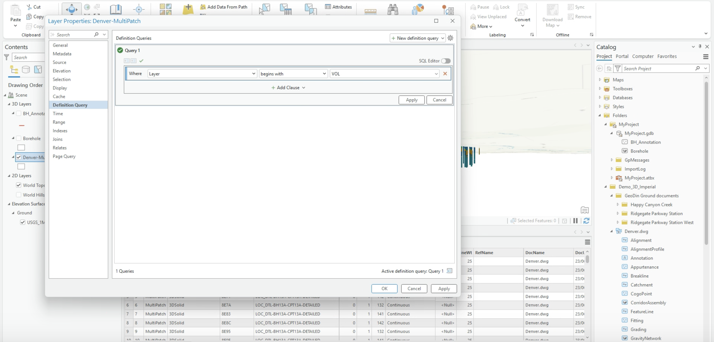
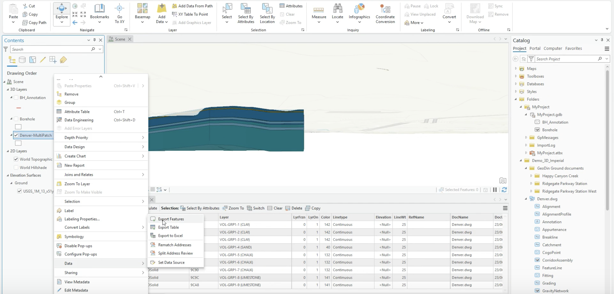
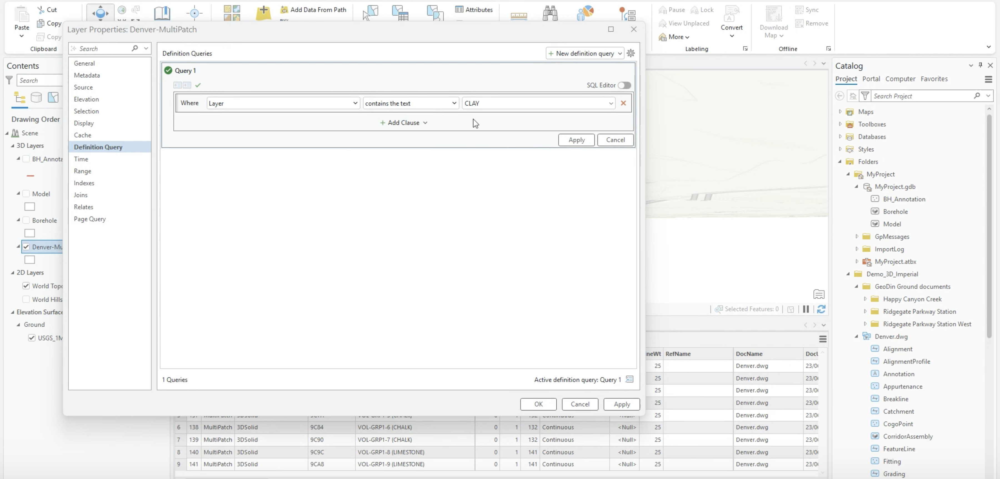
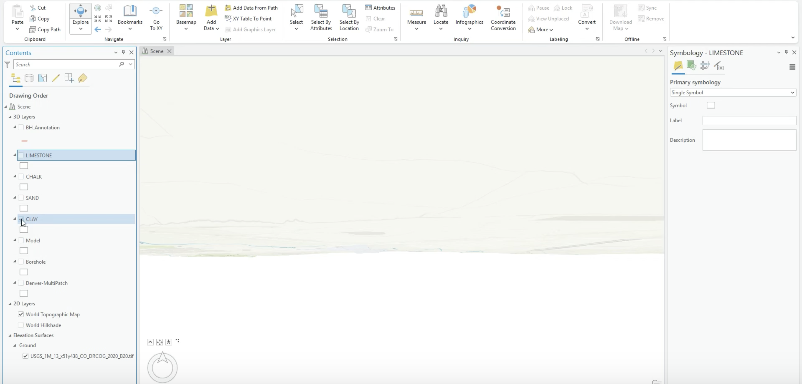

# Extracting boreholes, the model, and soil types

<!-- src: loom/arcgis-3d-C2 -->



> **Video chapters:** 0:00 Understanding the MultiPatch (LOC & VOL layers) · 0:42 Extracting boreholes with a definition query · 1:26 Exporting boreholes as a feature class · 1:52 Extracting the 3D model (VOL layers) · 2:29 Extracting individual soil types · 3:02 Building out all soil layers (limestone, chalk, sand, clay)

The MultiPatch brought in from the Civil 3D drawing ([previous tutorial](arcgis-pro-ground-model.md)) holds everything in one feature class: boreholes, the full 3D model, and every soil layer. This tutorial splits it into clean, separate feature classes — one for the boreholes, one for the model, one per soil type — so each can be reviewed, styled, shared, and analyzed independently. The later tutorials build on these outputs: the **Borehole** point class becomes the location markers in the [web scene](arcgis-web-scene.md).

## Step 1: Read the layer naming convention

- Open the MultiPatch attribute table and locate the **Layer** field.
- The names follow the GeoDin® Ground convention (see [Layer naming in the drawing](../boreholes/creating-surfaces-and-volumes.md#layer-naming-in-the-drawing)):
  - **LOC** prefix = boreholes
  - **VOL** prefix = model volumes (soil type in brackets)
- These prefixes drive every extraction below.

<figure><figcaption>
The Layer field with LOC-prefixed borehole records
</figcaption></figure>

## Step 2: Isolate the boreholes with a definition query

- Right-click the MultiPatch layer → **Properties → Definition Query**.
- Add a query: **Layer begins with** `LOC_`.
- Apply it and confirm only borehole features remain visible.

<figure><figcaption>
Definition query filtering to LOC_ records
</figcaption></figure>

## Step 3: Export the boreholes

- With the query active, run **Export Features** with **Use the filtered records** enabled.
- Save the output into the project geodatabase (for example, as `Borehole`).
- Turn off the original MultiPatch layer and confirm the boreholes now exist as their own feature class.

<figure><figcaption>
Export Features using the filtered records
</figcaption></figure>

## Step 4: Repeat for the 3D model

- Change the definition query to **Layer begins with** `VOL`.
- Confirm only the model volumes display, then **Export Features** again (for example, as `Model`).

<figure><figcaption>
Definition query switched to VOL records
</figcaption></figure>

<figure><figcaption>
Exporting the filtered model via Data → Export Features
</figcaption></figure>

## Step 5: Extract each soil type

- Use the same query-and-export pattern per soil type — for example **Layer contains the text** `CLAY` — and export each as its own feature class.
- Repeat for every soil type of interest (limestone, chalk, sand, clay…), confirming the expected number of layers each time.

<figure><figcaption>
Filtering a single soil type (CLAY)
</figcaption></figure>

- The result: one clearly named feature class per dataset, all in the project geodatabase.

<figure><figcaption>
All extracted feature classes — soil types, Model, and Borehole
</figcaption></figure>

***

**Cautionary notes**

- Verify the **Layer** values before applying a query, and check the active query before each export — an off-by-one filter exports the wrong features.
- Don't overwrite previously exported feature classes when saving multiple outputs.
- Turn the original MultiPatch off after extraction to avoid confusion during review.

**Next step:** [Attach geotechnical reports to the borehole annotations](arcgis-pro-attach-reports.md), or jump ahead to [publishing the model as a web scene](arcgis-web-scene.md).
