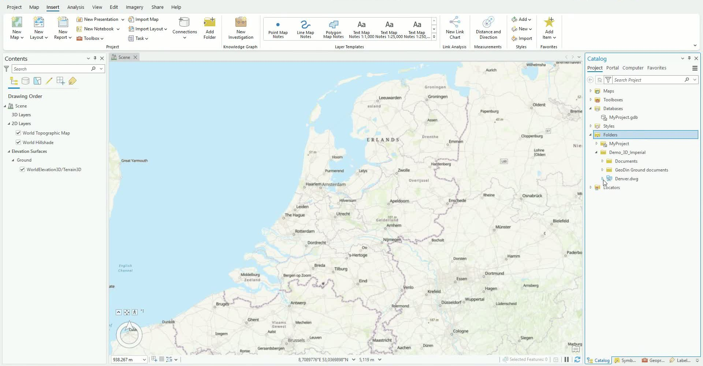
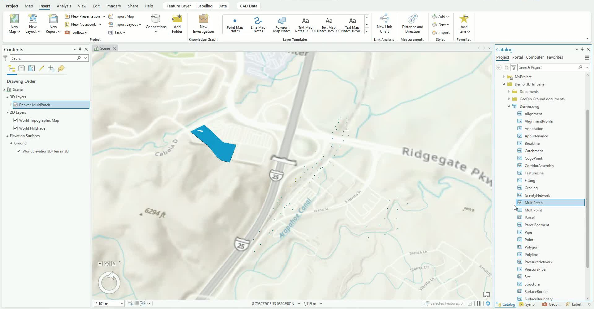
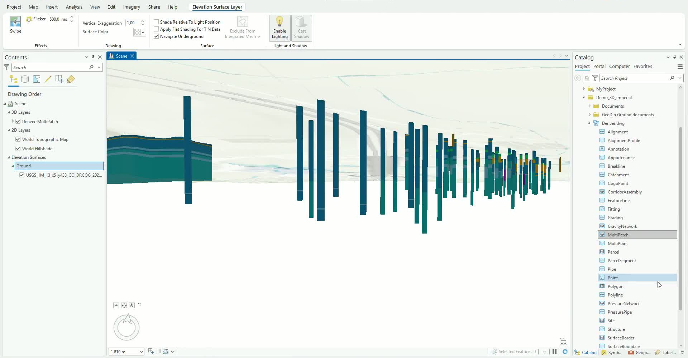
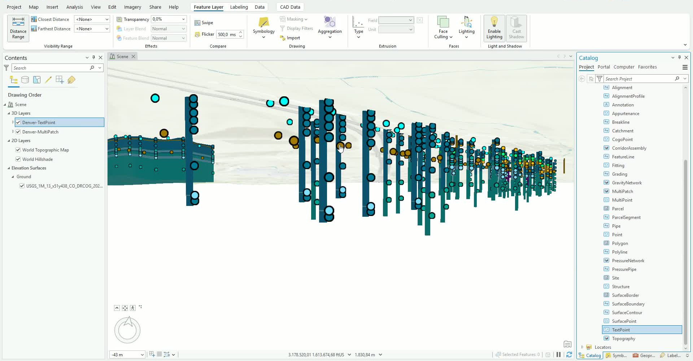
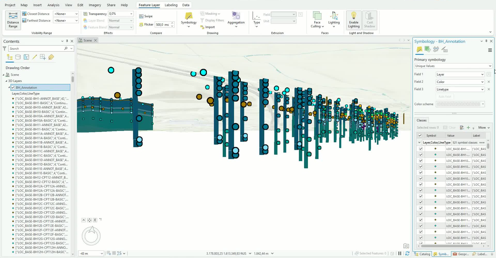
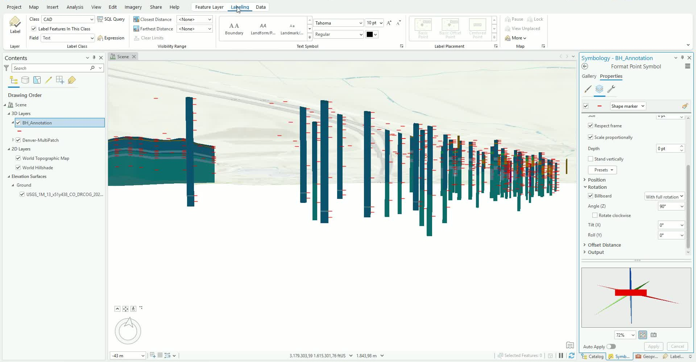
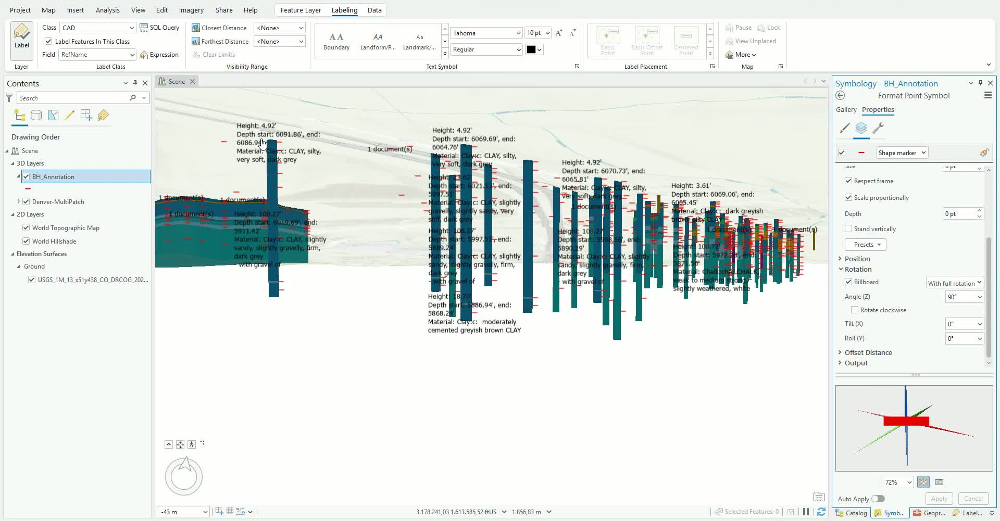

# Bringing the ground model into ArcGIS Pro

<!-- src: loom/arcgis-3d-C -->



> **Video chapters:** 0:00 Setting up a Local Scene | 0:30 Adding the Civil 3D drawing | 0:49 Loading the 3D model (MultiPatch) | 1:15 Adding ground & DEM elevation | 1:52 Navigating underground | 2:26 Adding borehole layer data (TextPoint) | 2:48 Exporting features | 3:11 Styling annotations | 4:19 Labeling boreholes | 4:52 Label placement

This tutorial walks you through opening a Civil 3D drawing that contains GeoDin® Ground boreholes and 3D ground model geometry directly in ArcGIS Pro - bringing the full model, not just point features, into a 3D GIS scene with underground navigation and readable borehole annotations.

## Requirements

- A saved Civil 3D drawing with imported boreholes ([Importing boreholes](../boreholes/importing-boreholes.md)) and, optionally, generated surfaces and volumes ([Creating surfaces and volumes](../boreholes/creating-surfaces-and-volumes.md)).
- The drawing georeferenced ([Georeferencing the drawing](arcgis-integration.md#georeferencing-the-drawing)) - a CRS mismatch surfaces here as a misplaced model.
- ArcGIS Pro with a project geodatabase.

### Step 1: Start a Local Scene

- In ArcGIS Pro, create a project using the **Local Scene** template.
- In the **Catalog** pane, confirm the project geodatabase under **Databases** - exported layers will be stored there later.

### Step 2: Connect the drawing folder

- In the **Catalog** pane, go to **Folders** and choose **Add Folder Connection**.
- Browse to the folder where the Civil 3D drawing was saved and click **OK**.
- Expand the connection to confirm the drawing (`.dwg`) is available - the GeoDin® Ground documents folder created on import sits alongside it.

<figure><figcaption>
The connected drawing folder with the DWG and the GeoDin® Ground documents folder
</figcaption></figure>

### Step 3: Add the 3D model geometry

- Expand the drawing to see its feature classes.
- Find the **MultiPatch** feature class - this holds the 3D ground model and borehole solids.
- Right-click it and choose **Add to Current Map**, then confirm the model and boreholes are visible in the scene.

<figure><figcaption>
The MultiPatch feature class added to the Local Scene
</figcaption></figure>

### Step 4: Set up elevation

- In the **Contents** pane, expand **Elevation Surfaces > Ground**.
- Keep the default **WorldElevation3D** surface, or remove it and add your own DEM (for example, a 1 m resolution dataset) for accurate alignment between the model and the terrain.


**DEM source:** the elevation data shown in the video is U.S. Geological Survey (USGS) 1 Meter DEM, obtained from [The National Map Downloader](https://apps.nationalmap.gov/downloader/). It is publicly available, so you can download the same dataset to follow along.


### Step 5: Enable underground navigation

- Select **Ground**, then open **Elevation Surface Layer** in the ribbon.
- Check **Navigate Underground** so the camera can move below the surface.
- Tilt the view to inspect the boreholes and model from underneath.

<figure><figcaption>
Navigate Underground enabled - borehole columns visible below the surface
</figcaption></figure>

### Step 6: Add the borehole annotation data

- The borehole layer text (heights, depths, materials) lives in a separate **TextPoint** feature class in the drawing.
- Add **TextPoint** to the map. At this stage it renders as plain points, not readable text.

<figure><figcaption>
The TextPoint dataset added - annotation as raw points
</figcaption></figure>

### Step 7: Export the annotation to the geodatabase

- To make the data easier to edit and share, run **Export Features** on the TextPoint layer and save the output into the project geodatabase (for example, as `BH_Annotation`).
- Remove the raw **TextPoint** layer afterwards and continue with the exported layer.

<figure><figcaption>
The exported BH_Annotation layer selected for styling
</figcaption></figure>

### Step 8: Style the annotation markers

- Open **Symbology** for the annotation layer and choose **Single Symbol**.
- Change the symbol to a thin **line marker**, set a distinct color (for example, red), and set the **angle to 90°** so markers read as elevation ticks along the borehole.
- Click **Apply**.

<figure><figcaption>
Format Point Symbol - line marker rotated 90°
</figcaption></figure>

### Step 9: Label with the layer text

- On the **Labeling** tab, set the **Label Class Field** to **RefName** and enable **Label**.
- The height, depth, and material descriptions now display along each borehole.
- Refine placement (for example, **Right of points**) and set a visibility distance in the **Feature Layer** ribbon to keep the scene readable.

<figure><figcaption>
Layer descriptions rendered as labels along the boreholes
</figcaption></figure>

## Optional settings

- **Elevation source** - the default WorldElevation3D surface works at global resolution; a project DEM (for example, 1 m) aligns the model precisely with the terrain.
- **Label visibility distance** - set a farthest distance on the Feature Layer ribbon so labels stay readable instead of stacking at wide zooms.

***

## Working with the imported model

The drawing arrives as two datasets that behave differently: the **MultiPatch** carries all geometry (boreholes and model volumes together), while **TextPoint** carries every annotation as plain points. Exporting TextPoint into the geodatabase before styling keeps the original drawing untouched and gives you an editable, shareable annotation layer - the same layer the later tutorials attach reports to and publish.

***

**Next steps:**

- [Extract boreholes, the model, and soil types](arcgis-pro-extract-features.md) into separate feature classes.
- [Attach geotechnical reports to the borehole annotations](arcgis-pro-attach-reports.md) so each document annotation carries its PDF.
- [Publish and review the model as a web scene](arcgis-web-scene.md) for browser-based stakeholder review.
