# Publishing and reviewing the model as a web scene

<!-- src: loom/arcgis-3d-E -->
<!-- src: loom/arcgis-3d-F -->



> **Video chapters:** 0:00 Adding borehole location points & labels | 1:17 Converting annotation units to meters | 2:26 Setting the WGS 1984 coordinate system | 2:42 Publishing the web scene | 3:31 Viewing the published scene online

The ground model in ArcGIS Pro ([Bringing the ground model into ArcGIS Pro](arcgis-pro-ground-model.md)) can be published as an **ArcGIS Online web scene**, so stakeholders review soil-type volumes, boreholes, and attached reports directly in a browser - no CAD or GIS software installed. For the 2D point-feature equivalent of this workflow, see [Publish to ArcGIS Online](https://docs.geodin.com/integrations-and-plug-ins/overview/publish-to-arcgis-online) in the GeoDin documentation.

## Requirements

- The ground model and annotation layers in ArcGIS Pro ([Bringing the ground model into ArcGIS Pro](arcgis-pro-ground-model.md)).
- The **Borehole** point feature class ([extracted from the MultiPatch](arcgis-pro-extract-features.md)), added with a single symbol and the borehole-name label so each location reads clearly on the ground surface.
- An ArcGIS Online account with publishing privileges.

### Step 1: Convert elevations to meters

Web scenes expect metric elevations. If the drawing's elevations are in feet:

- Run the **Adjust 3D Z** geoprocessing tool with **Reverse Sign of Z Values = Maintain Z Orientation**, converting **From Feet > To Meters**.

<figure>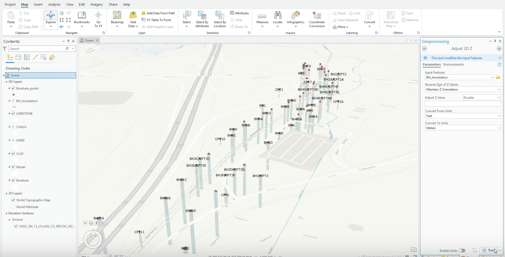<figcaption>
Adjust 3D Z converting feet to meters
</figcaption></figure>

- Then open **Layer Properties > Elevation** for the layer and set the vertical units to **Meters**. Zoom in afterwards to confirm the annotation sits correctly.

<figure>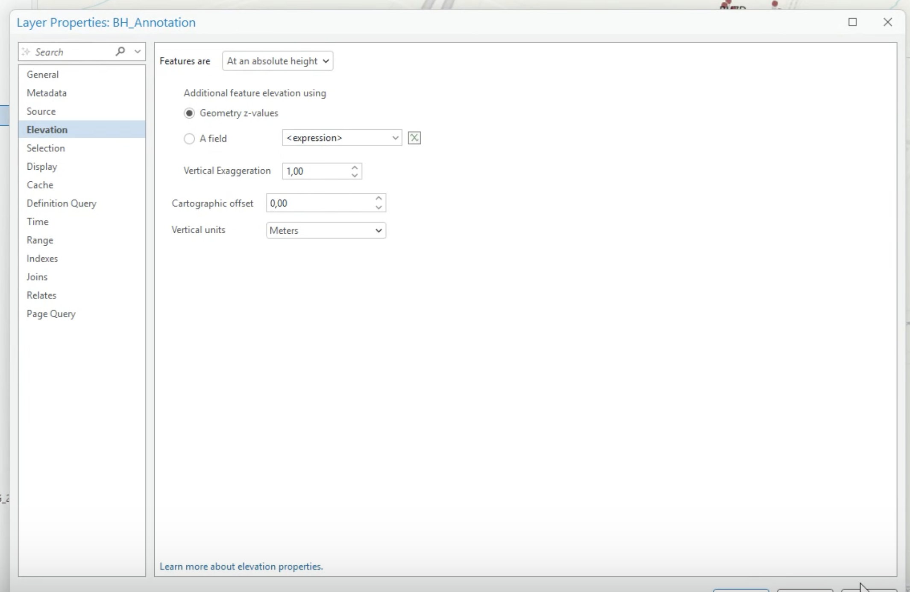<figcaption>
Layer elevation set to geometry z-values in meters
</figcaption></figure>

### Step 2: Set the scene coordinate system

- Open the scene's **Map Properties > Coordinate Systems** and select **WGS 1984 Web Mercator (auxiliary sphere)** - the coordinate system web scenes require.

<figure>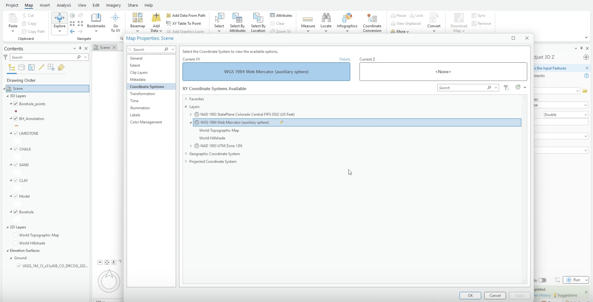<figcaption>
Scene coordinate system set to WGS 1984 Web Mercator
</figcaption></figure>

### Step 3: Share the web scene

- On the **Share** tab, choose **Web Scene**.
- Enter a name, pick the destination folder, and set the sharing level (owner, organization, or public).

<figure>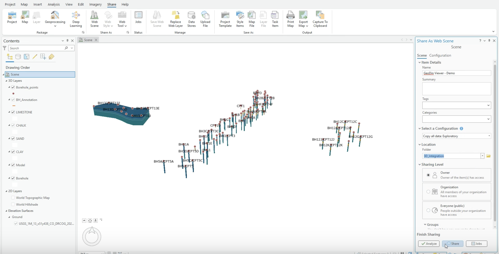<figcaption>
The Share As Web Scene pane
</figcaption></figure>

### Step 4: Analyze, publish, verify

- Click **Analyze** and resolve every error before publishing.

<figure>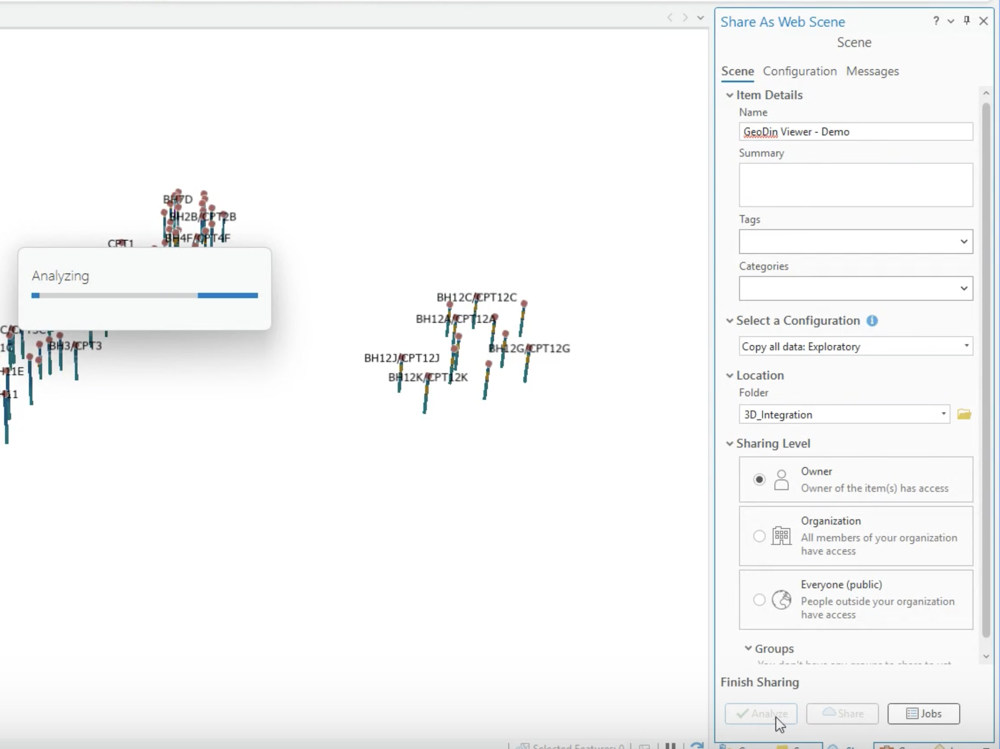<figcaption>
Analyze running before publication
</figcaption></figure>

- Click **Share** to publish, allow processing to finish, then open the item's portal page and confirm all layers are present.

## Reviewing the scene in the browser



> **Video chapters:** 0:00 Opening the scene & making the basemap transparent | 0:36 Exploring borehole info & documents | 1:08 Viewing the model by soil type | 1:33 Adding borehole location points on the ground | 1:58 Styling markers & choosing a basemap | 3:07 Slicing the 3D model | 4:06 Capturing & saving a slice

Open the published item with **Open in Scene Viewer**.

- **See through the ground:** open **Basemap** and raise **Ground transparency** so the subsurface model is visible in context.

<figure>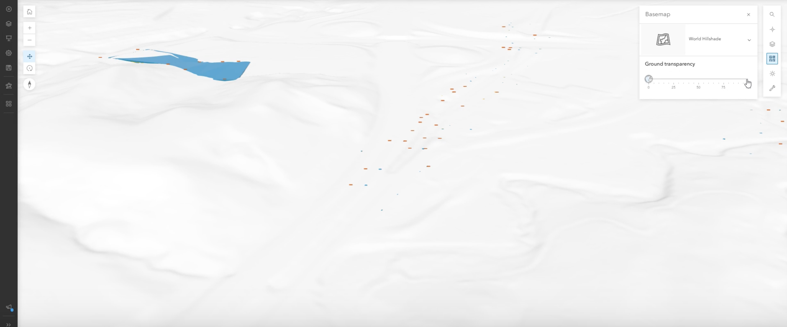<figcaption>
Ground transparency revealing the model below the surface
</figcaption></figure>

- **Toggle layers:** in **Layers**, switch soil-type volumes (clay, sand, chalk, limestone...) and boreholes on and off to focus the review. Clicking a document annotation opens its pop-up - including the attached geotechnical report.

<figure>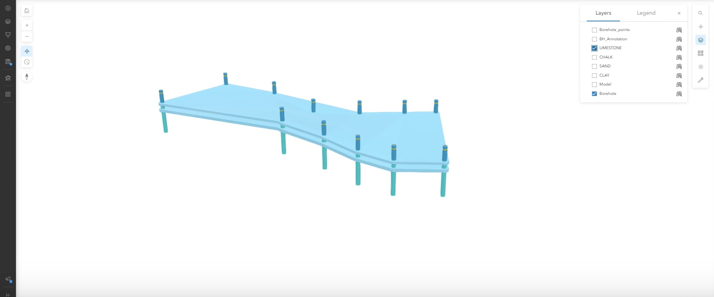<figcaption>
Soil-type volume layers with boreholes in Scene Viewer
</figcaption></figure>

- **Keep location markers on the surface:** set the borehole point layer's elevation placement to **On the ground**, so markers sit on the terrain instead of inside the model.

<figure>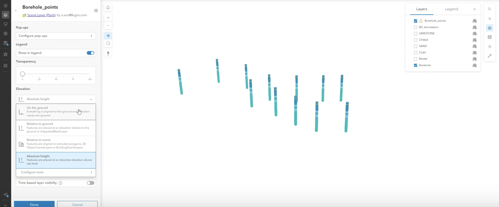<figcaption>
Elevation placement options for the borehole points layer
</figcaption></figure>

- **Style the markers:** open **Layer Style** for the borehole points and use the **3D Object** drawing style with a distinct marker color and size, so boreholes are easy to identify against any basemap.

<figure>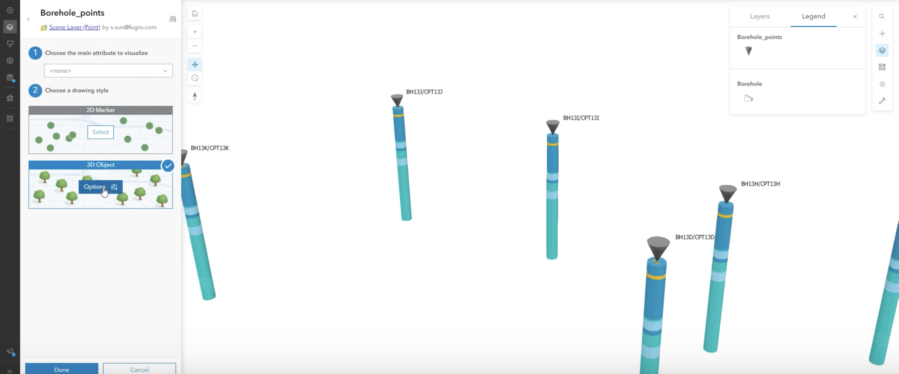<figcaption>
3D Object drawing style for the borehole points
</figcaption></figure>

- **Pick an informative basemap:** open **Basemap** and choose a map with stronger geographic context (imagery, streets, topographic...) for the final review - then turn the model back on to see the subsurface against its surroundings.

<figure>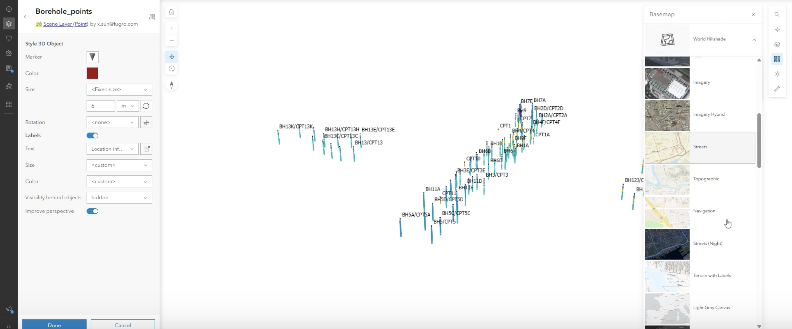<figcaption>
Choosing a basemap with more geographic context
</figcaption></figure>

- **Slice the model:** with the **Slice** tool (under Scene tools; hold **Shift** for a vertical slice), cut into the model to inspect subsurface structure and borehole relationships. Adjust the slice angle until the internal features are clearly visible.
- **Capture the view:** open **Slide Manager** and use **Capture slide** to save the current slice view - captured slides are stored with the scene, ready for reporting or the next stakeholder session.

<figure>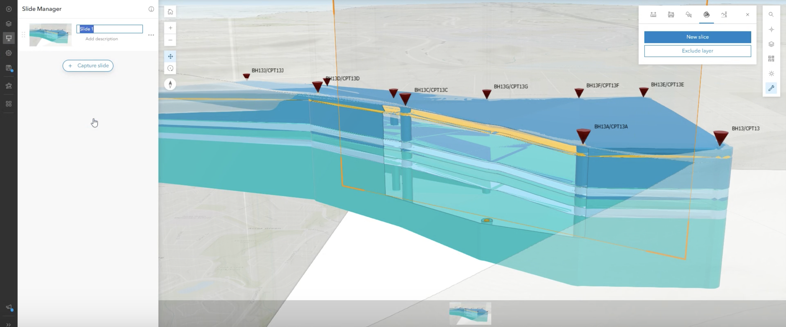<figcaption>
A vertical slice through the model, captured as a slide in Slide Manager
</figcaption></figure>


**Off the shelf.** Everything in this section is standard Esri **Scene Viewer** functionality - no GeoDin®-specific setup or add-in is needed once the scene is published. Esri's Scene Viewer documentation covers every control here in full depth.


***


🌐 **Try it live:** a public demo scene produced with this workflow is available at [arcg.is/0rD1OL3](https://arcg.is/0rD1OL3) - open it in Scene Viewer and explore the volumes, annotations, and Slice tool without setting anything up.

