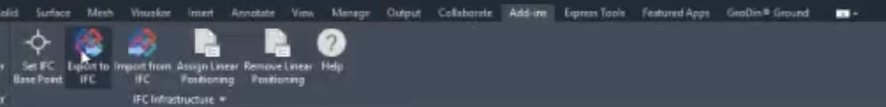

# BIM handoff via IFC 4.3

A Civil 3D drawing containing a GeoDin® Ground model can be exported to IFC. The ground model - surfaces, volumes, and boreholes - is written into the IFC file, so a downstream BIM consumer receives the ground alongside the rest of the drawing's content. <!-- src: loom/ifc-export -->

## Running the export

The export is driven by Civil 3D's own IFC exporter. GeoDin® Ground does not add an IFC export command of its own; it has a separate ribbon tab.

On the **Add-ins** ribbon tab, open the **IFC Infrastructure** panel and choose **Export to IFC**, then choose a location and file name for the `.ifc`. <!-- src: loom/ifc-export#export-command -->

<figure><figcaption>
The <strong>IFC Infrastructure</strong> panel on the <strong>Add-ins</strong> tab, with the separate <strong>GeoDin® Ground</strong> tab alongside it. These are Civil 3D's own IFC commands, not the plug-in's.
</figcaption></figure>

The same panel also contains **Set IFC Base Point**, **Import from IFC**, **Assign Linear Positioning**, and **Remove Linear Positioning**. These are Autodesk commands; see Autodesk's documentation for what they do. <!-- src: loom/ifc-export#ribbon -->

Each export writes a JSON log file next to the `.ifc`, named after it - for example, `Drawing1a.ifc` and `Drawing1a_log.json`. <!-- src: loom/ifc-export#export-outputs -->

***

## Reference: inside the exported file

This section is for BIM coordinators and anyone writing a downstream consumer of the file. You do not need it to produce a handoff.

It describes one observed export: a GeoDin® Ground model exported from Civil 3D 2026 by exporter `Autodesk - Civil 3D 2026 IfcInfra Plugin - 13.8.378.0`. Other Civil 3D or exporter versions may differ.

### Schema, units, and geometry

The file declares the `IFC4X3_ADD2` schema. Units are meters, square meters, cubic meters, and radians. <!-- src: loom/ifc-export#schema-and-units -->

Ground model geometry arrives as **triangulated meshes**, not parametric solids: elements carry a tessellated body representation built from a Cartesian point list and a triangulated face set. All elements are collected under a single site container. <!-- src: loom/ifc-export#geometry -->

### How ground units are identified

Ground elements are written as **generic terrain elements**. Each carries its unit name - for example, `GRP1-1 (Sand) TOP`. <!-- src: loom/ifc-export#entity-type -->

Identification therefore rests on the **presentation layer name and color** attached to each element, carried over from the Civil 3D layers GeoDin® Ground drew them on. Three layer prefixes were observed in the exported file:

| Prefix | Observed example | Content |
|---|---|---|
| `SRFC-` | `SRFC-GRP1-1 (SAND)` | Surfaces |
| `VOL-` | `VOL-GRP1-1 (SAND)` | Volumes |
| `LOC_` | `LOC_BASE-BH03-BASIC`, `LOC_DTL-BH01-DETAILED` | Borehole locations |

A consumer that cannot read a formal classification can separate surfaces, volumes, and boreholes by matching on these prefixes. <!-- src: loom/ifc-export#layer-naming -->


Ground units export as generic terrain elements, not as dedicated geotechnical entity types. See [Known limitations and roadmap](../support/known-limitations-and-roadmap.md).


### Properties recorded on the project

The export attaches a property set named `Custom_Properties` to the IFC **project** - not to individual elements. A viewer that shows properties per selected element will not display it; to find it, search the `.ifc` text for `Custom_Properties`.

The following property names were present:

- `UUID`
- `GEODIN_SELETED_DATABASE`
- `GEODIN_BOREHOLE_DIAMETER`
- `GEODIN_BOREHOLE_HEIGHT_MULTIPLIER`
- `GEODIN_SURFACE_POINT_SPREAD_SIZE`
- `GEODIN_SURFACE_POINT_SPREAD_NUM_POINTS`

<!-- src: loom/ifc-export#property-set -->


**Property name spelling:** `GEODIN_SELETED_DATABASE` is not a docs typo - the property name is misspelled in the file itself. A parser reading these properties must match the name as written.


### Before you send the file on

An `.ifc` file is plain text and can be opened in any text editor. Two things to check when the recipient is outside your organization:

- The file records an **owner history** containing the user name and organization of whoever ran the export. Review it if that attribution should not leave your team.
- The `.ifc` and its `_log.json` are separate files. Send whichever the recipient has asked for. <!-- src: loom/ifc-export#owner-history -->

***

If the receiving side only needs a GIS view of the boreholes, see [ArcGIS integration](arcgis-integration.md) instead.
