# Sharing ground models with Autodesk Forma

Two people share ground data through a Forma project in the cloud. **User A** (the geotechnician) builds the ground model in GeoDin Ground inside Civil 3D and saves the drawing to a folder that syncs automatically with Forma. **User B** (any colleague with access to the project) opens Forma and sees the drawing and all attached borehole reports - no manual file transfer needed.

<figure>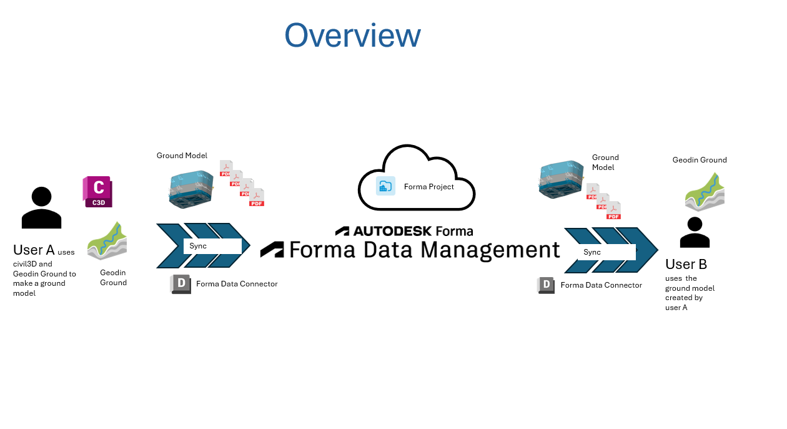<figcaption>
User A saves the drawing and borehole reports to a local Desktop Connector folder; the files upload to Forma automatically for User B to open in a browser.
</figcaption></figure>

The sync happens through a free Autodesk tool called the **Desktop Connector**, which creates a local folder on your machine that mirrors a Forma project in the cloud. Anything saved into that folder is uploaded automatically.

## Requirements

| What | Notes |
|------|-------|
| Autodesk Forma account | With a project already created, or permission to create one |
| Autodesk Desktop Connector | Free download from Autodesk, installed and signed in |
| Civil 3D with GeoDin Ground | Licensed and connected to your GeoDin database |
| Project access | Both users must be members of the same Forma project |

## Sharing the ground model

<figure>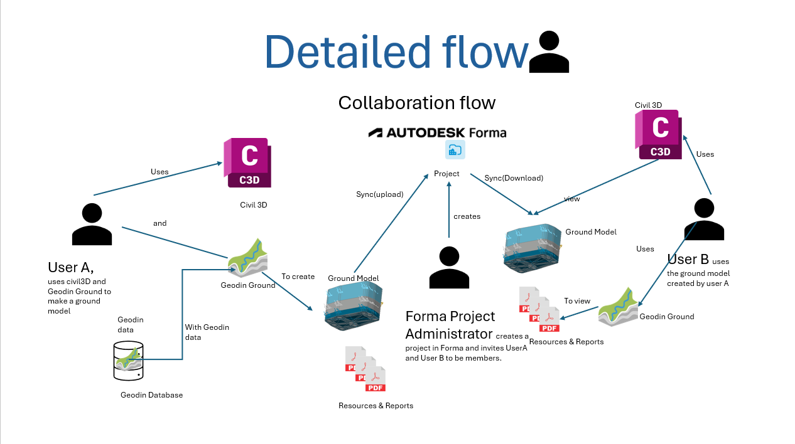<figcaption>
The full workflow at a glance: from creating the Forma project and setting up Desktop Connector, through to colleagues viewing borehole reports in a browser.
</figcaption></figure>

1. Create a project in Forma
2. Add the project to Desktop Connector (creates a local sync folder)
3. Open Civil 3D and connect to your GeoDin database
4. Load and draw the boreholes, 
5. Save the drawing into the Desktop Connector sync folder.
6. Build the ground model
7. Confirm the sync - icons turn green when upload is complete
8. Check the drawing and borehole reports in Forma

### Step 1: Create a project in Forma

Open Autodesk Forma in your browser and create a new project. Give it a name that matches your site (for example, *Denver*). Make sure any colleagues who need access are added as members.

<figure>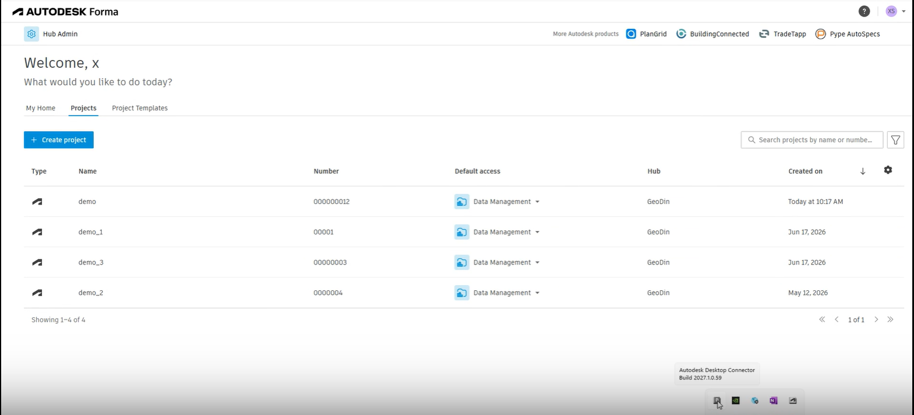<figcaption>
The Forma project list. Create a project for the site and add any colleagues who need access as members.
</figcaption></figure>

### Step 2: Set up the Desktop Connector

Install the Autodesk Desktop Connector if you have not already. Once installed and signed in, open it and click **Select Projects**.

<figure>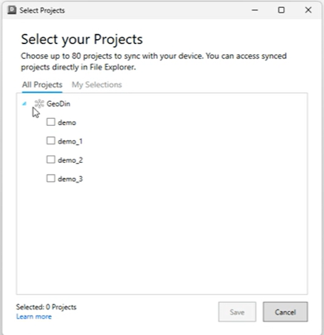<figcaption>
Open Desktop Connector and click <strong>Select Projects</strong> to link a Forma project to a local sync folder.
</figcaption></figure>

You will see the projects available in your Forma hub. Tick the project you just created and click **Save**, then **OK**.

<figure>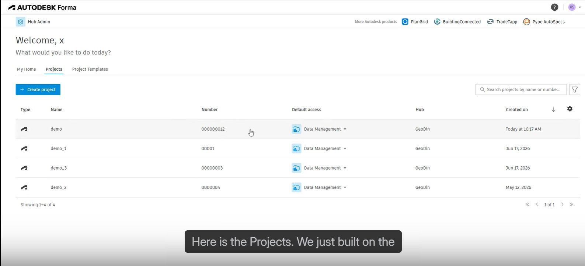<figcaption>
Tick the project and click <strong>Save</strong>, then <strong>OK</strong>. Desktop Connector creates a local folder linked to that project - the folder will be empty at this point.
</figcaption></figure>

### Step 3: Open Civil 3D and connect to GeoDin

Open Civil 3D and start a new drawing (or open an existing one). In the GeoDin Ground panel, connect to your database and select the site you are working on.

<figure>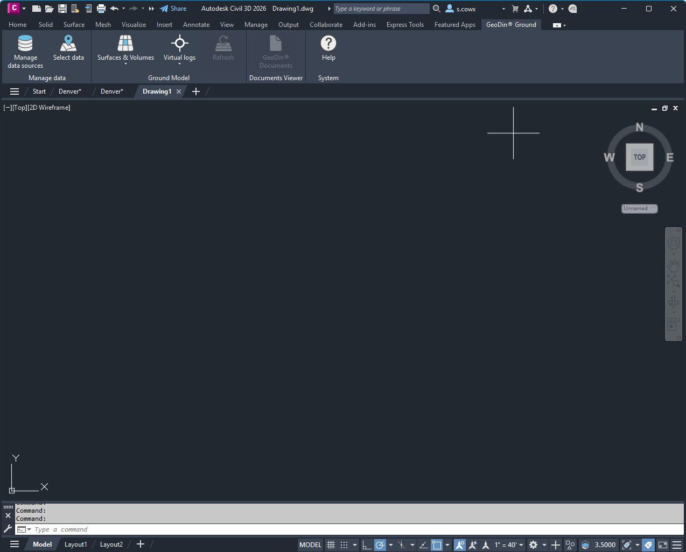<figcaption>
Civil 3D with the GeoDin Ground panel open. Connect to your database to load borehole data for the site.
</figcaption></figure>

Select your database - in this example the *Denver* demo database is used.

<figure>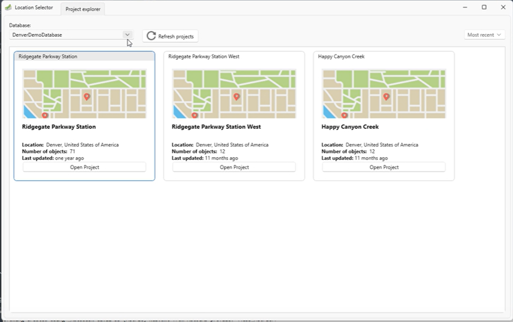<figcaption>
GeoDin Ground database selection. Choose the database for your site.
</figcaption></figure>

### Step 4: Load and draw the boreholes, 

Select the boreholes for your site from the GeoDin database and draw them into the Civil 3D drawing. GeoDin Ground places each borehole at its correct plan position and adds the layer and borehole data.

<figure>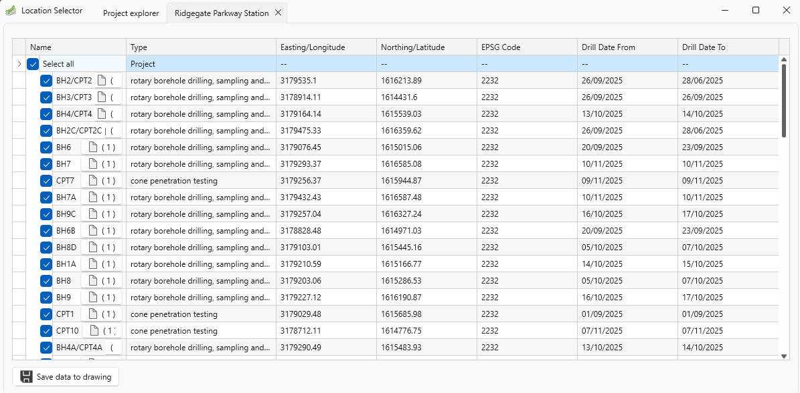<figcaption>
Select the boreholes for your site. You can draw boreholes from more than one GeoDin project into the same drawing.
</figcaption></figure>

<figure>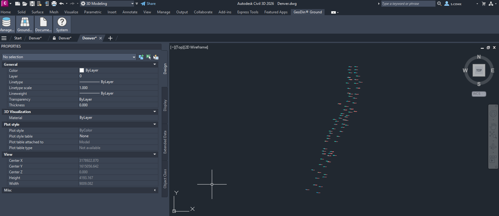<figcaption>
Boreholes drawn into the Civil 3D drawing at their correct plan positions.
</figcaption></figure>

<figure>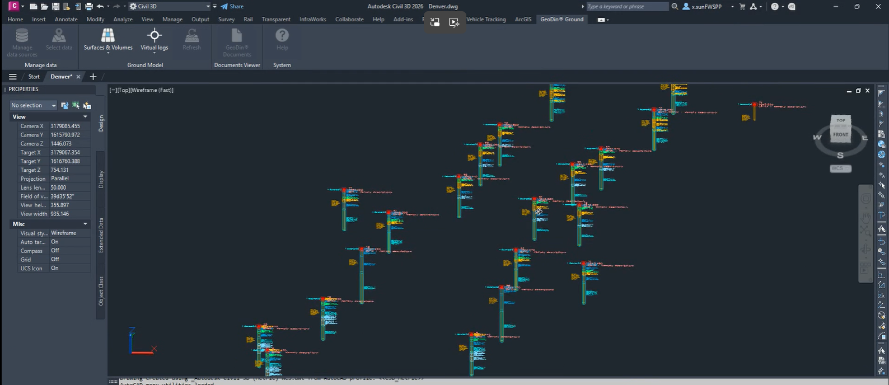<figcaption>
A closer view showing borehole detail and layer data.
</figcaption></figure>

### Step 5: Save the drawing to the Forma sync folder

This is the key step. When you save the drawing, **save it into the Desktop Connector folder** created in step 2 - not your usual project folder.

<figure>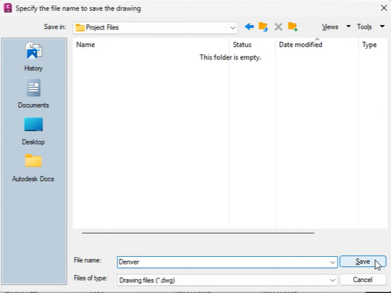<figcaption>
Save the drawing into the Desktop Connector sync folder, not your usual project folder. This is what triggers the upload to Forma.
</figcaption></figure>

As soon as you save, GeoDin Ground automatically exports all the borehole reports (PDF logs) linked to the boreholes in this drawing. These are placed in a sub-folder alongside the DWG file.

<figure>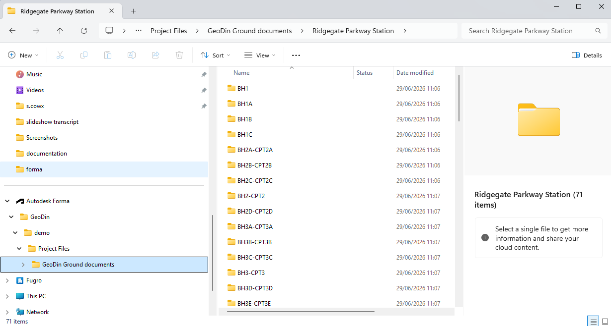<figcaption>
GeoDin Ground creates a documents sub-folder next to the DWG and exports each borehole's PDF reports into it automatically.
</figcaption></figure>

<figure>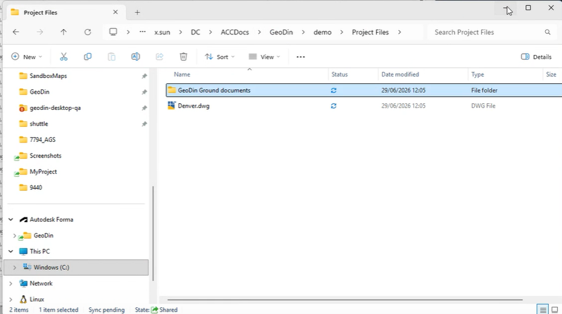<figcaption>
The exported borehole reports inside the documents sub-folder.
</figcaption></figure>

### Step 6: Build the ground model

Once you have all the borehole data you need, use GeoDin Ground to create the ground model surface. You can view the result in Civil 3D before saving.

<figure>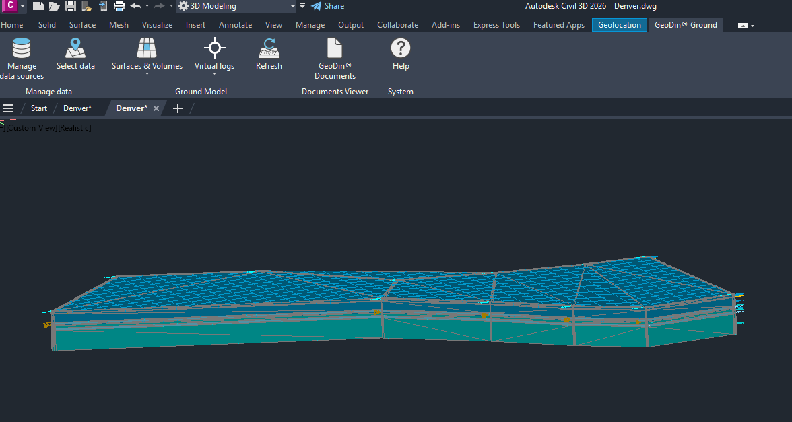<figcaption>
The ground model surface generated from borehole data, visible in Civil 3D before saving.
</figcaption></figure>

### Step 7: Confirm the sync

After saving, check the Desktop Connector folder in Windows Explorer. The icons next to the files will turn **green** once they have been successfully uploaded to Forma.

<figure>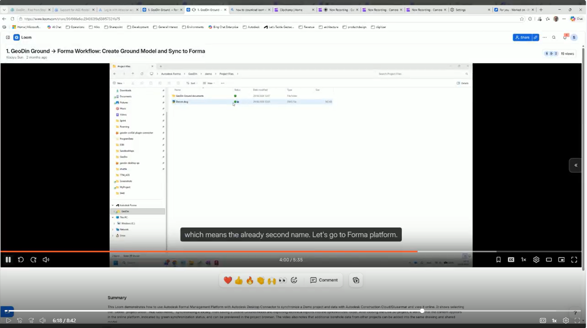<figcaption>
Green icons confirm the files have been uploaded to Forma. If the icons are not yet green, wait a moment and refresh - the sync is usually quick.
</figcaption></figure>

### Step 8: Check the result in Forma

Open Autodesk Forma in your browser and navigate to the project. You will see the DWG file and a folder called **GeoDin Ground documents** (or similar).

<figure>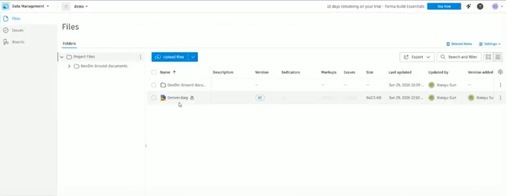<figcaption>
Forma showing the synced drawing and the GeoDin Ground documents folder alongside it.
</figcaption></figure>

Open the document folder. Inside you will find a folder for each borehole.

<figure>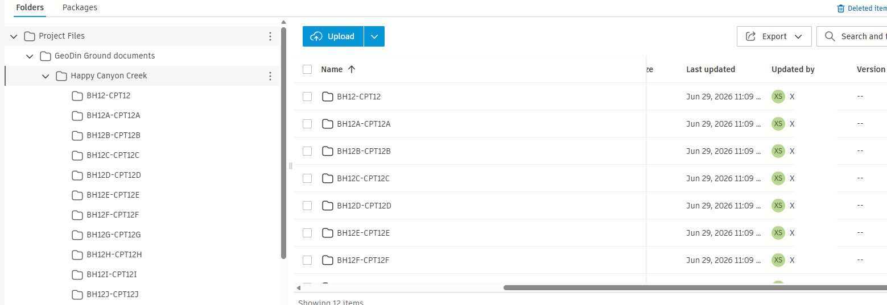<figcaption>
The documents folder contains a sub-folder for each borehole.
</figcaption></figure>

Open a borehole folder to see the geotechnical reports (PDF logs) for that borehole.

<figure>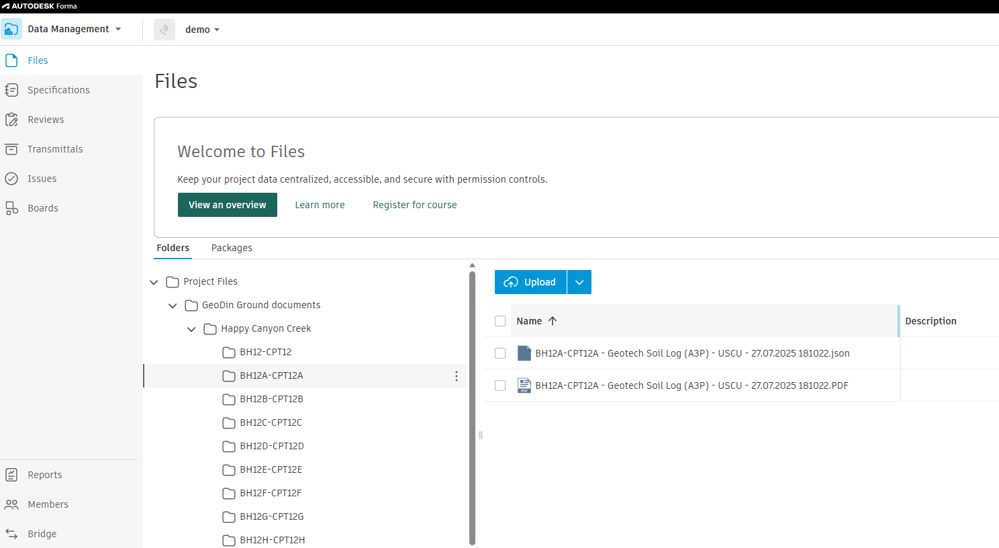<figcaption>
A borehole folder showing the geotechnical reports (PDF logs) for that borehole.
</figcaption></figure>

Click on any report to open and read it directly in Forma.

<figure>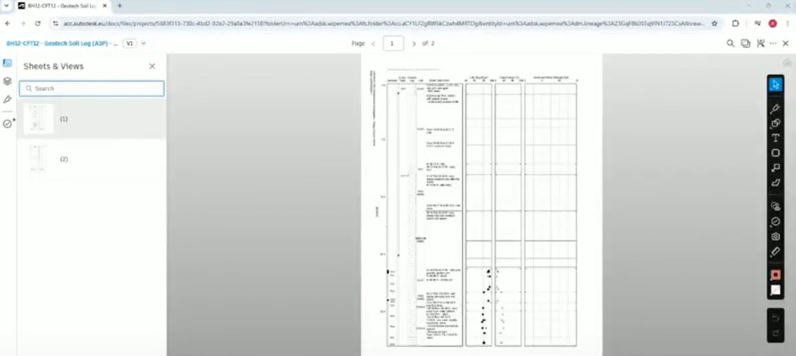<figcaption>
Click any report to open and read the borehole log directly in Forma.
</figcaption></figure>

You can also see all reports for all boreholes from the top-level documents folder.

<figure>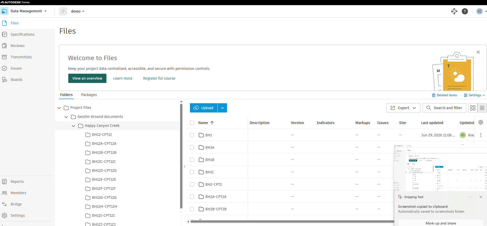<figcaption>
All borehole reports are accessible from the top-level documents folder.
</figcaption></figure>

***

## Working with Forma

### File locking - what the padlock icon means

When User A has the DWG open in Civil 3D, Forma shows a **padlock icon** next to the drawing file. This prevents two people from overwriting each other's work.

<figure>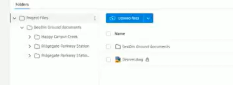<figcaption>
Forma shows a padlock icon when the DWG is open in Civil 3D. The lock is released when User A closes the file.
</figcaption></figure>

Once User A closes the file (or releases it), the lock is removed. If you need to force-unlock it - for example if the original user is offline - right-click the file in Windows Explorer via Desktop Connector and choose **Desktop Connector > Unlock**. Use this carefully, as any unsaved changes from the original user could be lost.

### What User B does

User B does not need Civil 3D or GeoDin Ground to view the outputs. They simply:

1. Open Autodesk Forma in a browser
2. Navigate to the shared project
3. Browse the drawing and borehole report folders as shown in step 8

If User B does have Civil 3D and wants to open the DWG locally, they can add the same Forma project to their own Desktop Connector. The drawing and all reports will sync down to their machine automatically.

## Troubleshooting

| Problem | Likely cause | Fix |
|---------|-------------|-----|
| Files not syncing (icons stay grey) | Desktop Connector not running | Check it is open and signed in to the correct account |
| Borehole reports missing from Forma | Drawing not saved to the sync folder | Check the save location; resave to the Desktop Connector folder |
| Drawing shows as locked | Another user has it open | Wait for them to close it, or unlock via Desktop Connector right-click |
| Project not visible in Desktop Connector | Not added yet | Open **Desktop Connector > Select Projects** and add it |
| Colleague cannot see the project in Forma | Not a project member | Ask a Forma project admin to add them |
