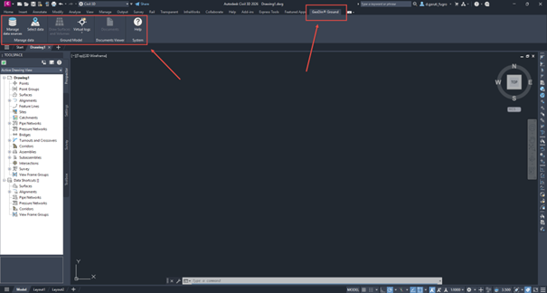
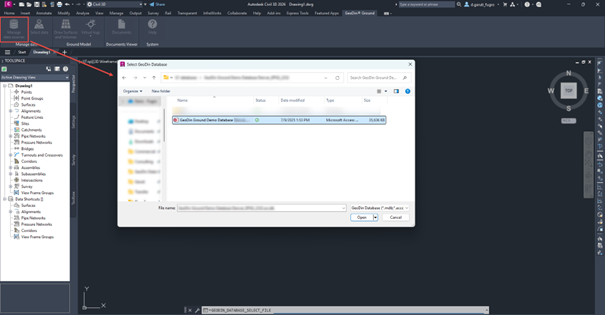
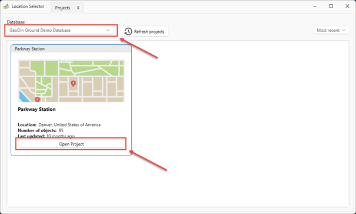
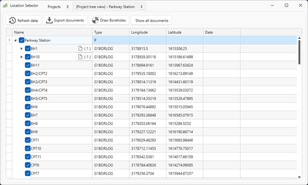
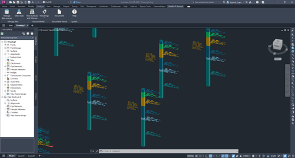
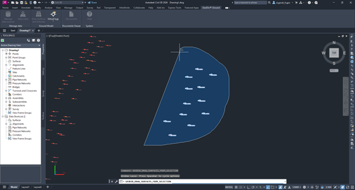
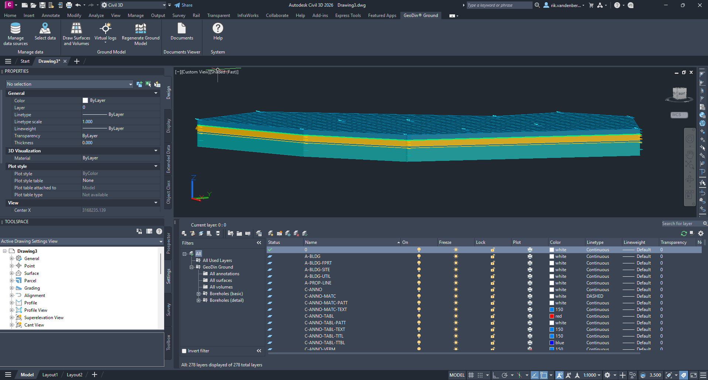

# First steps



After installing the plugin, a new ribbon tab _GeoDin® Ground_ will appear in Civil 3D, providing access to a set of commands for working with geotechnical data. These commands allow you to select or connect to an existing GeoDin database (either connected or file-based), draw boreholes, create surfaces and 3D solids, and browse borehole documents directly within Civil 3D. To use the ribbon and its features, you must first open a new or existing drawing in Civil 3D.

<figure><figcaption></figcaption></figure>

## 1. Adding a new data source

The plugin is allows you to work with existing GeoDin database connection, or you can manually select a GeoDin database file. By clicking the _Manage data sources_ button, a dialogue window opens, which allows you to select a database file. Once selected and opened, the selected database will be added to the list of available databases in the next step. If you do not have a GeoDin database, the plugin installer comes with a sample database. Alternatively, the sample database can also be downloaded here:



<figure><figcaption></figcaption></figure>

## 2. Selecting boreholes to be drawn

The next step is to browse your GeoDin projects and boreholes. By pressing _Select data,_ the new dialog will be opened where you can view the list of available data sources and their respective projects. 

<figure><figcaption></figcaption></figure>

Opening a project allows you to dig deeper and view the related boreholes and drillings from that project. Pressing the _Open Project_ button opens a new tab in the current dialog and will show you the list of boreholes and documents. 

<figure><figcaption></figcaption></figure>

## 3. Drawing boreholes

Open the borehole treeview and make a selection of the boreholes you wish to draw in Civil 3D. Once you have made a selection, you can click on _Draw boreholes_. The selected boreholes and drillings are then imported in the Civil 3D and draw as a 3D presentation of the different groundlayers. The different layers and ground units are displayed with different colors. Furthermore, the ground descriptions recorded in GeoDin are visible as annotations on the right side of the borehole. The location's general data, such as coordinates, elevation, and EPSG code are visible on the left side.

> 💡 **Tip:** switch the Civil 3D visual style to **Shaded** to make the cylinders and layer colours easier to read. Annotations can be toggled on or off per borehole, or for all boreholes at once, from the **Layer Properties** section.

> ℹ️ **Attached documents.** When you save boreholes to a drawing, GeoDin® Ground also offers to export any **documents** attached to those boreholes in the database - PDF logs, photos, and reports. A separate dialog asks where to save them locally. You can skip this step if you do not need the documents offline.

> ⚠️ Note: after importing, the boreholes displayed in Civil 3D are no longer connected with the GeoDin database. Changes made on the Civil 3D objects are not written back into the GeoDin database.

<figure><figcaption></figcaption></figure>

## 4. Drawing surfaces and volumes

Finally, with the plugin, you can create a 3D surface and volume representation of a logical group of boreholes. By pressing the _Draw Surfaces and Volumes_ command, you can select a logical group of boreholes. 

<figure><figcaption></figcaption></figure>

Once you have made your selection, you can press enter to confirm your input. The plugin will then, based on an algorithm that identifies corresponding soil groups based on the layer depths of the surrounding boreholes, create the surfaces and volumes in Civil 3D.

<figure><figcaption></figcaption></figure>

## Where to go next

- [Importing boreholes](../boreholes/importing-boreholes.md) - detail on the selection dialog, supported ground-description standards, and what the visualisation looks like.
- [Creating surfaces and volumes](../boreholes/creating-surfaces-and-volumes.md) - how the interpolation works and how to refine the ground model.
- [What are virtual logs](../virtual-logs/what-are-virtual-logs.md) - add synthetic boreholes to steer the ground model.
- [Overlaying your design on the ground model](../documentation/overlaying-design-on-ground-model.md) - use cases for combining ground and design.
- [What comes across from the GeoDin® database](../documentation/what-comes-across.md) - exactly what is and isn't rendered in Civil 3D.