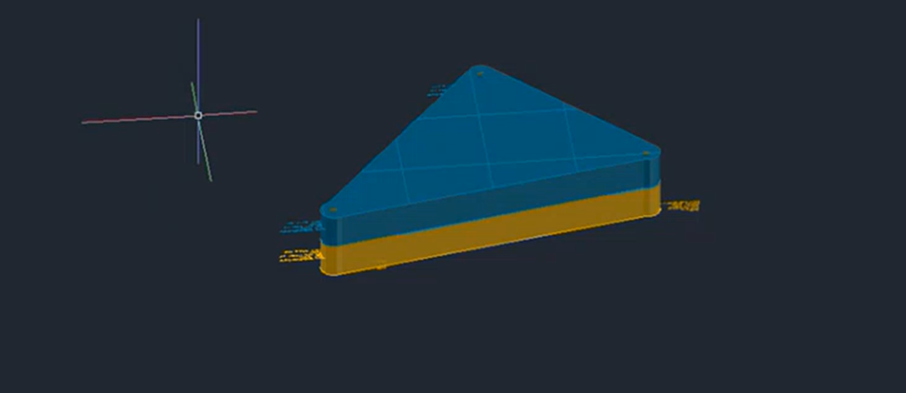
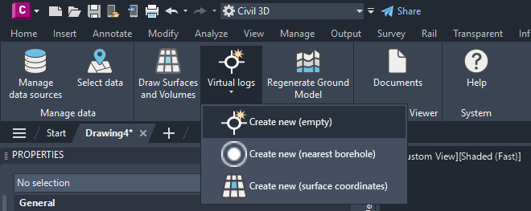
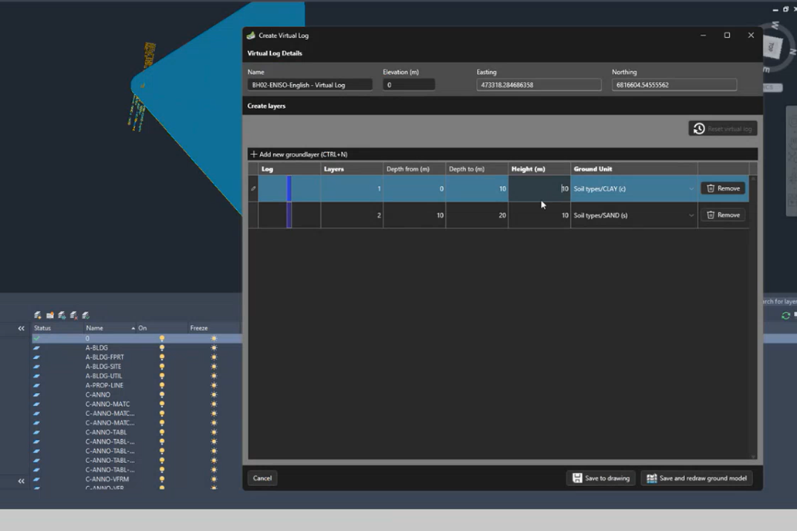
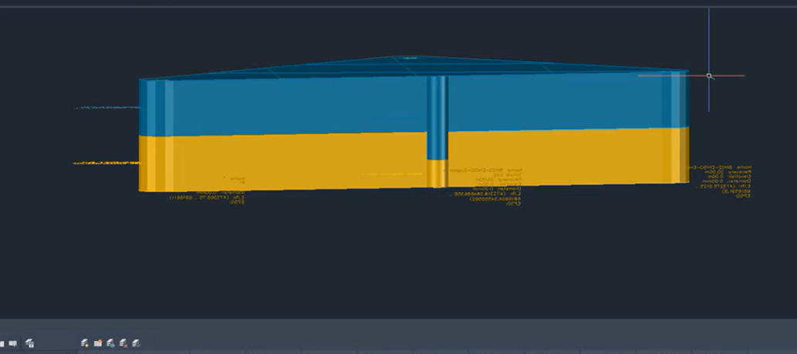

# Creating Virtual Logs

This tutorial guides you through the process of creating virtual logs (artificial boreholes) in Civil3D. Virtual logs allow you to create synthetic borehole data at specific locations to supplement your existing geological data, helping you build more accurate ground models.

## Creating an empty virtual log

To begin creating a virtual log, you'll need a drawing that already contains boreholes or a new model where you plan to add them. In this example, we have three existing boreholes labeled A, B, and C, and we'll create a virtual log along the edge between B and C.

<figure><figcaption></figcaption></figure>

1. Locate the Virtual Log button in the ribbon menu and click it.
2. A submenu will appear with three options: Empty, Nearest Borehole, and Surface Interpolations.
3. For this tutorial, select the **Empty** option (we'll cover the other options in future tutorials).
4. You'll be prompted to specify coordinates for your virtual log:
    - Enter coordinates manually, or 
    - Click directly in the drawing to place the virtual log.
5. Once you've defined the location, proceed to the next step.

<figure><figcaption></figcaption></figure>

## Virtual log dialog

After specifying the location, a Virtual Log Designer dialog will open.
In the top section, you can provide:
 - **Name**: Enter a unique identifier for your virtual log
 - **Elevation**: Set the ground level elevation at which the borehole penetrates the surface

 The dialog also contains a section for adding ground layers, which we'll explore next.

<figure><figcaption></figcaption></figure>

## Adding and managing ground layers

The ground layers represent the different geological sections of your borehole. In a real-world scenario, these would be determined by drilling operations and laboratory analysis. But with virtual logs, and inside this dialog, you can fully create an artificial borehole containing different kinds of soil and/or rock types. To add a new groundlayer:

1. Click the "Add Layer" button to create a new ground layer
1. For each ground layer, specify:
    - Soil or rock type
    - Depth in meters

Once you have created a number of ground layer, you can freely modify them as well. You can:

- Update properties of existing layers
- Move layers up or down to change their sequence
- Add new layers between existing ones
- Remove layers as needed

The final step is to save the virtual log and let the plugin draw the 3D presentation in your Civil 3D drawing.

## Finalizing and viewing your virtual log

Once you've finished designing your virtual log:

1. Review all information to ensure accuracy
2. Click the "Save to drawing" to create the virtual log
3. The virtual log will be drawn in your Civil 3D drawing

The newly created virtual log will appear visually similar to your real boreholes, making it nearly indistinguishable except by its name. This similarity ensures that your design and ground model closely match expected results.

<figure><figcaption></figcaption></figure>

By creating strategic virtual logs, you can enhance the accuracy of your geological models in areas where physical drilling data is unavailable. In the next tutorial, we will show how you can update your ground model (the surfaces and volumes) to reflect the newly added virtual logs.

## Other creation modes

This tutorial used the **Empty** option. GeoDin® Ground offers two additional creation modes for virtual logs:

- [**Nearest Borehole**](creating-virtual-logs-nearest-borehole.md) - copies the stratigraphy from the closest real borehole. Useful when the target location is expected to resemble a neighbour.
- [**Surface Interpolation**](creating-virtual-logs-surface-interpolation.md) - samples the currently generated ground model at the virtual log's location. Useful for locking in the model's current prediction as a constraint.

## Tip - save and regenerate in one step

After designing your virtual log, clicking **Add and refresh layer generation** saves the log and immediately regenerates the surfaces and volumes to reflect it. This avoids a separate trip back to **Draw Surfaces and Volumes** when you are iterating quickly. See [Updating the ground model](updating-surfaces.md) for the full regeneration flow.

> ⚠️ Virtual logs - whether Empty, Nearest Borehole, or Surface Interpolation - are **not persisted to the GeoDin® database**. They exist only in the current Civil 3D drawing.