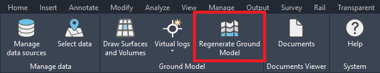
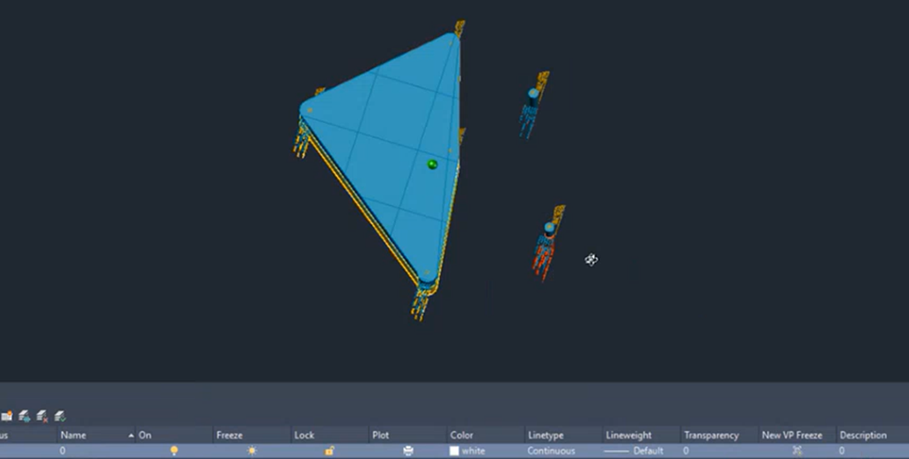
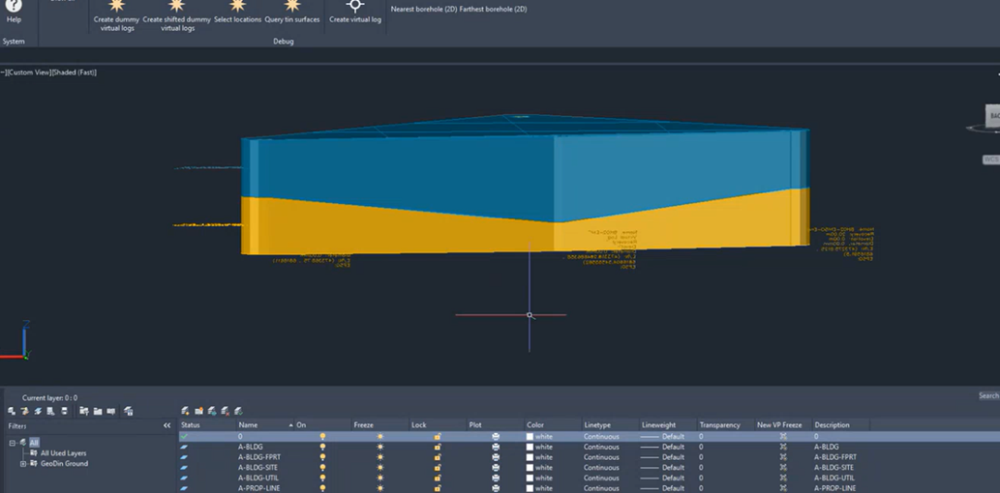
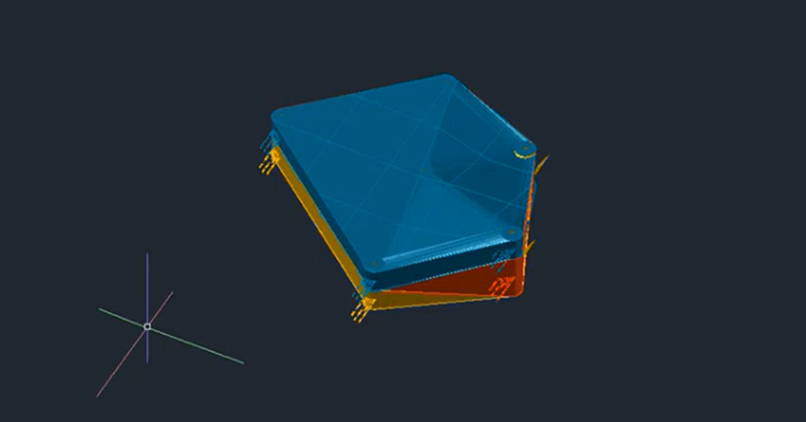

# Updating the ground model

When working with geotechnical data in Civil3D, you may need to update your ground model after adding virtual logs or importing new boreholes. This tutorial walks you through the process of updating surfaces and volumes to reflect these changes in your geotechnical design.

## When to update surfaces and volumes

Given a ground model of boreholes, you have the ability to import additional boreholes or create artificial ones by making virtual logs. While the action to update the surface/volumes is relatively simple, it's important to note that many different scenarios might require you to update them. Some examples are:

- Deleting a borehole(s)
- (Re)importing additional borehole(s)
- Creating virtual log(s)
- Changing settings or parameters

However, in this tutorial we will showcase the example of creating virtual logs. The principle is the same where the underlying data or boreholes have changed, and there we need to update the surface/volumes to get the correct insights and calculations in your geotechnical design.

<figure><figcaption></figcaption></figure>

## Before regeneration

To get started, we assume you have done all previous steps of creating a drawing with boreholes. You have imported boreholes and generated the surface/volumes previously. Below you will find two examples. In example A, we have a previous model, where we have added a virtual log to correct the edges of the ground model. In example B, we have extended the original ground model with additional boreholes outside the original area.

| Example A: Edge Correction | Example B: Extending Area |
|---------|--------------|
| <figure><figcaption></figcaption></figure> | <figure><figcaption></figcaption></figure> |

## Regenerating the ground model

Given these new boreholes next to the existing model, we simple have to press the _Regenerate ground model_ button in the ribbon to redraw the surfaces and volumes. All current created surfaces and volumes are removed, and the plugin restarts the original process of creating the 3D representation. But, this time it accounts with the newly created boreholes and includes them into the consideration of the algorithm.

| Example A: Edge Correction (result) | Example B: Extending Area |
|---------|--------------|
| <figure><figcaption></figcaption></figure> | <figure><figcaption></figcaption></figure> |