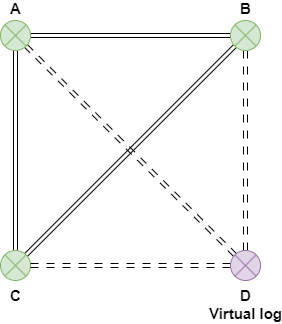
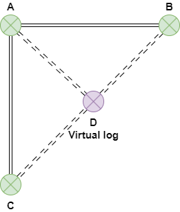
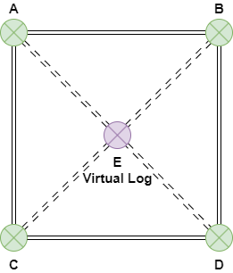

# Enhancing Geological Modeling with Virtual Logs in Civil3D



## Understanding Virtual Logs

Virtual logs are a powerful feature in our Civil 3D plugin that allows users to create synthetic borehole data within a three-dimensional geological model environment. Unlike physical boreholes, which require costly drilling operations and are limited by accessibility, regulations, and budget constraints, virtual logs can be generated anywhere within your model to enhance the completeness and accuracy of subsurface representations.

> ⚠️ Note: Virtual logs are not persisted to your GeoDin database.

Virtual logs function as artificial data points that interpolate geological information based on surrounding known boreholes. They enable engineers and geologists to:

- Fill data gaps between physical boreholes
- Test different geological scenarios without additional drilling
- Improve the accuracy of surface and volume calculations
- Create more detailed and realistic geological models
- Validate geological interpretations

The system clearly distinguishes virtual logs from real borehole data through visual indicators, metadata, and naming conventions, ensuring data integrity and preventing misinterpretation of synthetic data as actual field measurements.

## Use Cases for Virtual Logs

Virtual logs provide value in numerous scenarios:

1. **Sparse Data Enhancement**: When physical borehole data is limited, virtual logs can fill gaps to create more comprehensive models.

2. **Terrain Transition Refinement**: In areas where geological formations change rapidly, virtual logs can model these transitions more accurately than simple interpolation between distant physical boreholes.

3. **Hypothesis Testing**: Engineers can create multiple virtual logs to test different geological scenarios without the cost of physical drilling.

4. **Surface Generation Improvement**: Virtual logs provide additional control points for surface generation algorithms, resulting in more accurate terrain models.

5. **Volume Calculation Precision**: By adding strategic virtual logs, volume calculations between surfaces become more precise, especially in areas with complex geological structures.

6. **Inaccessible Area Modeling**: For areas where physical drilling is impossible or prohibited, virtual logs offer a way to approximate geological conditions.

7. **Project Planning**: Before committing to expensive drilling operations, virtual logs can help determine optimal locations for physical boreholes.

## Example 1: Improving Surface Models with Triangle to Square Formation

In this example, we have an area with three physical boreholes (A, B, and C) arranged in a triangle. The simple interpolation between these points creates a basic triangular surface that may not accurately represent the actual terrain.

By adding a virtual log (D) to form a square arrangement, we can significantly improve the surface model. The virtual log interpolates data from the three known points, creating a more nuanced representation of the terrain.

<figure><figcaption></figcaption></figure>

Without the virtual log, the surface model simply creates triangular faces between the three physical boreholes, potentially missing important terrain features. With the addition of virtual log D, the model now has four control points, allowing for a quadrilateral surface that better captures the true ground conditions.

## Example 2: Edge Refinement for Gradual Transitions

In this example, we have three boreholes (A, B, and C) with a direct linear interpolation between points B and C. However, the actual terrain doesn't follow this straight-line transition but instead follows a more gradual curved path.

By adding a virtual log (D) along the edge between B and C, we can create a more accurate representation of the terrain transition. Instead of a direct line from B to C, the model now follows a path from B to D to C, capturing the gradual change in geological properties.

<figure><figcaption></figcaption></figure>

This approach is particularly useful when geological formations don't change linearly between known points. The virtual log D allows for a more realistic transition by providing an intermediate control point informed by surrounding geological data.

## Example 3: Central Interpolation for Comprehensive Coverage

In our final example, we have four physical boreholes (A, B, C, and D) arranged in a square. While this provides good coverage of the corners of our area of interest, it leaves the center without direct measurement.

By adding a virtual log (E) at the center point between all four boreholes, we can significantly enhance our understanding of the central area. The virtual log E interpolates data from all surrounding boreholes, creating a comprehensive central reference point.

<figure><figcaption></figcaption></figure>

Without the central virtual log, the surface model would simply connect the four corner points, potentially missing any rises or depressions in the central area. With virtual log E in place, the model can now accurately represent central terrain features such as hills, valleys, or other geological formations.

This central virtual log is particularly valuable for volume calculations, as it ensures that the central area's contribution to the overall volume is properly accounted for rather than being oversimplified through direct corner-to-corner interpolation.

## Injecting knowledge the boreholes don't capture

A common reason to use a virtual log is not to fill a geometric gap but to **encode knowledge** that real boreholes do not capture. For example, if external tests or site observations show that a silt layer present in the real borehole set should **not** continue across the middle of the site, drop in a virtual log at that location without the silt layer and regenerate the ground model. The silt layer will be squeezed out of the interpolation in that area — the model now reflects what you know, not just what the boreholes alone suggest.

This is the reason virtual logs survive regeneration while hand-edits on the generated solids do not: the virtual log acts as an **additional constraint** that future regenerations will respect.

## Next steps

In the next tutorials, we will guide you how to create virtual logs using our plugin. Three creation modes are available:

- [**Empty**](creating-virtual-logs.md) — place the virtual log and enter the layer stack by hand.
- [**Nearest Borehole**](creating-virtual-logs-nearest-borehole.md) — copy the stratigraphy from the closest real borehole and edit.
- [**Surface Interpolation**](creating-virtual-logs-surface-interpolation.md) — sample the currently generated ground model at the virtual log's location, then edit.